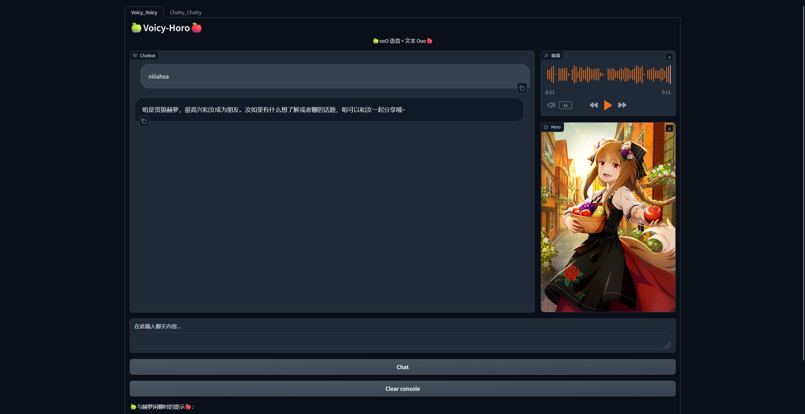
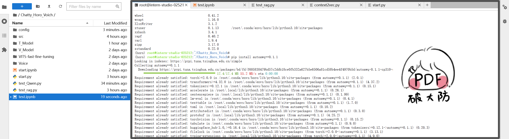
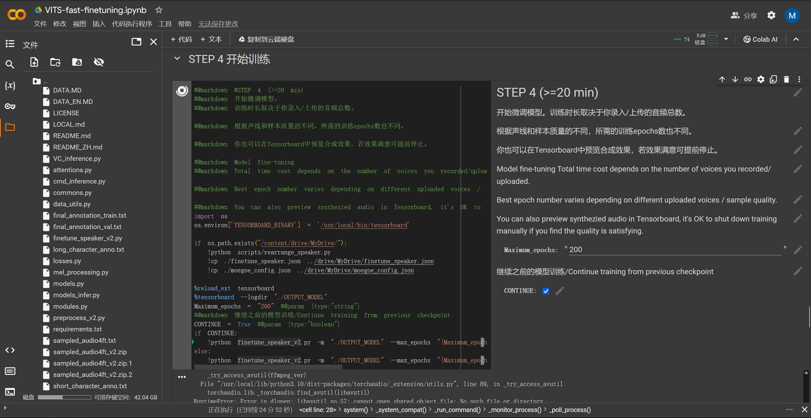

# 🎯**超强版本分享 && 多模态强化 && Chatty_Horo_Voich**🎯
> **“一段旅途的结束，是另一项征程的开始。” -> 那路**

## **😎"Basic Introduction" And "模型构架"😎**

## **☃️"Bug" And "解决方案"☃️**

### **问题 1：`autoawq` 记得要控制版本**

**这个包不会因为版本问题和其他环境产生冲突，实际上是发生冲突但是不会报错。如果遇到以下错误，建议降低版本 (e.g. 执行命令 `pip install autoawq==0.1.1`):**

    import awq_inference_engine  # with CUDA kernels
    ImportError: libcudart.so.12: cannot open shared object file: No such file or directory

### **问题 2：语音训练应用了巨佬的 `Google Colab` 笔记本(强推)**

**按照该笔记本，基本没有出现任何问题，除了再 Step.3 中需要添加内容(否则会报错)：**

    !echo '/usr/lib64-nvidia' > /etc/ld.so.conf.d/libcuda.conf; ldconfig