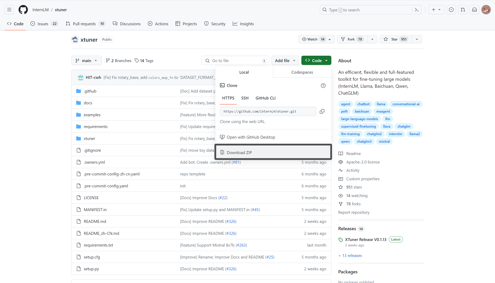
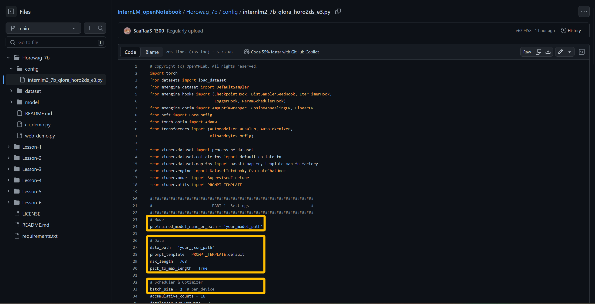
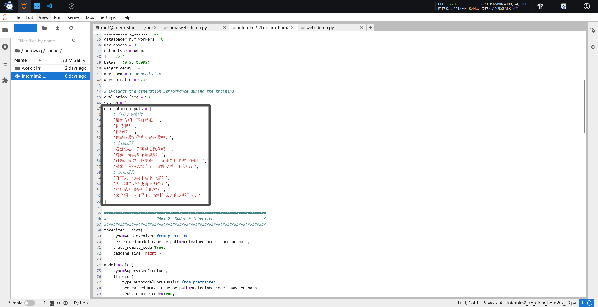
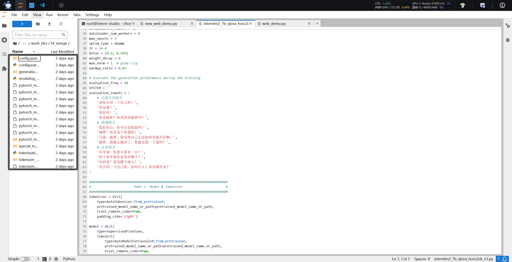
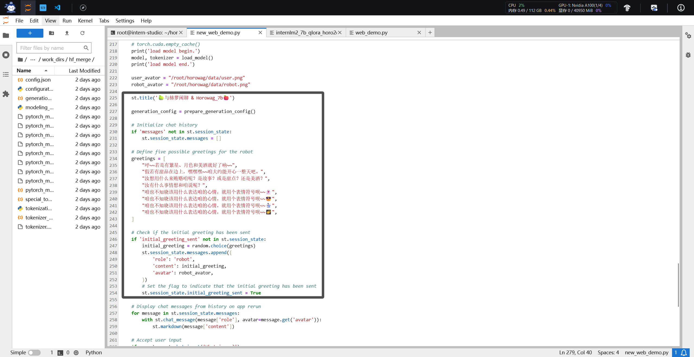
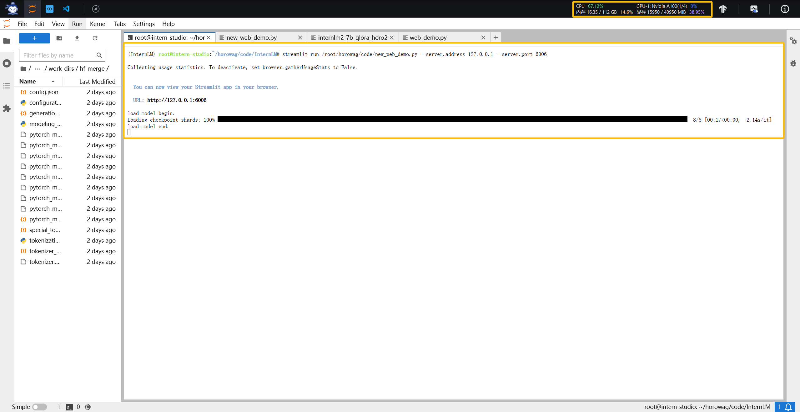
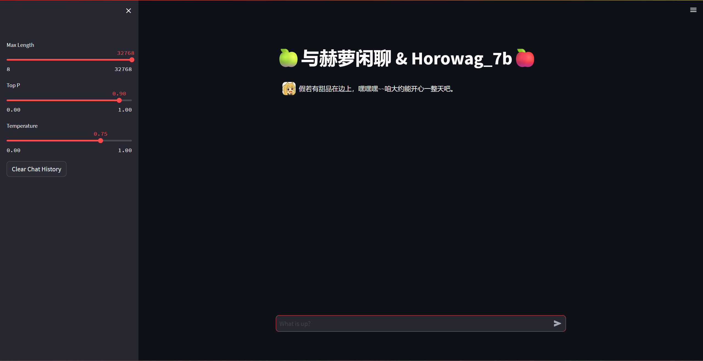
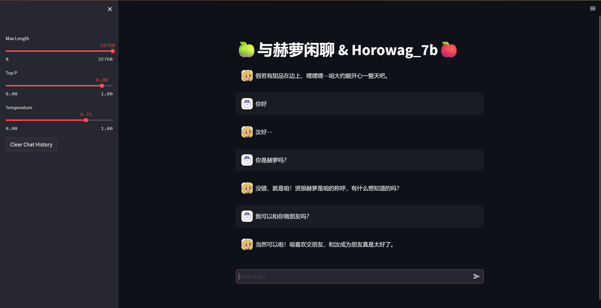

# 🐺**与赫萝闲聊 && Horowag_7b**🐺
> **“咱的赫萝对话模型出炉啦~~” -> 那路**

## **Introduction**

| 基础属性 | 模型相关解释 |
|:-------:|:-------:|
| 模型基座 | InternLM2-Chat-7b |
| 微调方法 | QLoRA |
| 目标 | 将《狼与香辛料》中贤狼赫萝的形象带入大语言模型，完成角色扮演任务 |
| 技术库 | Xtuner + Transformers |
| 硬件 | (1/2) A100 |
| 数据来源 | 自制的贤狼赫萝对话语料(约千条) |

------

Horowag_7b 是由书生·浦语的 InternLM2-Chat-7b 经过微调得到的角色扮演聊天机器人。具体目标是将《狼与香辛料》中贤狼赫萝的形象带入大语言模型，实现带入感较高的角色扮演行为。针对技术细节，Horowag_7b 使用了书生·浦语开源的 Xtuner 进行低成本微调训练，在训练条件较差的条件下，赋予模型高质量的自然语言处理能力。硬件方面，我采用了 (1/2) A100 支持训练，显存约40G左右，如果参数调节合理，显存可控制在 16G 以下。

## **模型实现**
### **环境配置**

**我采用了 `Xtuner` 的标准配置，具体方法如下：**

    git clone https://github.com/InternLM/xtuner.git
    cd xtuner
    pip install -e '.[all]'

**如果遇到了 `git` 连接失败的问题，我的解决方案是，先使用浏览器登陆 `github`，然后下载 `Xtuner` 的 `master.zip` 文件，解压到对应路径中，然后执行 `pip` 命令。**

**同样，我还需要安装`streamlit`等`web`相关的包。这里推荐访问我的 github 仓库: [InternLM_openNotebook](https://github.com/SaaRaaS-1300/InternLM_openNotebook/tree/main), 获取其中的 `requirements.txt` 并根据该文件安装，同样可以完成环境配置：**

    # 升级pip
    python -m pip install --upgrade pip

    pip install modelscope==1.9.5
    pip install transformers==4.35.2
    pip install streamlit==1.24.0
    pip install sentencepiece==0.1.99
    pip install accelerate==0.24.1

**对版本执行验证，输入以下命令，如果不出错误，即证明安装完成：**

    xtuner list-cfg

### **数据配置**

**我采用了自制的贤狼赫萝对话语料`horo2ds`，其中包括：**
+ **`狼与香辛料动漫` 第一季赫萝的有关对话**
+ **`狼与香辛料轻小说` 第一卷、第二卷赫萝的有关对话以及最后一卷的随机对话**
+ **ChatGPT 进行数据增强之后的赫萝对话语料**
+ **我进行主观清洗之后的自制数据增强语料(😵‍💫工作量微微有亿点大😵‍💫)**

> **P.S.** 我是不会承认自己是因为太累了导致后面的数据没做出来的。

**训练数据参考格式为 `oasst1(映射)`, 具体样例如下：**

    [{
        "conversation":[
            {
                "system": "xxx",
                "input": "xxx",
                "output": "xxx"
            },
            {
                "input": "xxx",
                "output": "xxx"
            }]
    }, {
        "conversation":[
            {
                "system": "xxx",
                "input": "xxx",
                "output": "xxx"
            },
            {
                "input": "xxx",
                "output": "xxx"
            }]
        }
    ]

### **微调配置**

**我采用 `xtuner` 自带的训练脚本，通过调试和修改，达到了可以接受的微调效果：**

**我更改了很多细节，具体可以参考`Github`中的`internlm2_7b_qlora_horo2ds_e3.py`脚本，该脚本修改方法与我在 `Lesson-4` 里修改的方法相近，具体参考链接: [Lesson-4-Notebook](https://github.com/SaaRaaS-1300/InternLM_openNotebook/blob/main/Lesson-4/Lesson-4-Notebook.md)😃**

**对于其他微调方法，建议采用以下命令获取列表，查找相关文件：**

    xtuner list-cfg -p internlm

**其中`-p` 为模糊查找，若想训练其他模型，可以修改 `internlm` 为 `Xtuner` 支持的其他模型名称。如果所提供的配置文件不能满足使用需求，请导出所提供的配置文件并进行相应更改：**

    xtuner copy-cfg ${CONFIG_NAME} ${SAVE_DIR}

**例如通过下列命令将名为 internlm_7b_qlora_oasst1_e3 的 config 导出至当前目录下：**

    xtuner copy-cfg internlm_7b_qlora_oasst1_e3 .

**最后，再执行微调命令：**

    # 单卡
    ## 用刚才改好的config文件训练
    xtuner train ./internlm_chat_7b_qlora_oasst1_e3_copy.py

    # 多卡
    NPROC_PER_NODE=${GPU_NUM} xtuner train ./internlm_chat_7b_qlora_oasst1_e3_copy.py

    # 若要开启 deepspeed 加速，增加 --deepspeed deepspeed_zero2 即可

### **合并自己的微调参数 hf_merge**

**训练完成之后，我需要转换参数为 HuggingFace 格式。**

    # 创建用于存放Hugging Face格式参数的hf文件夹
    mkdir /root/config/work_dirs/hf

    export MKL_SERVICE_FORCE_INTEL=1

    # 配置文件存放的位置
    export CONFIG_NAME_OR_PATH=/root/config/internlm_chat_7b_qlora_horo2ds_e3_copy.py

    # 模型训练后得到的pth格式参数存放的位置
    export PTH=/root/config/work_dirs/internlm_chat_7b_qlora_horo2ds_e3_copy/epoch_3.pth

    # pth文件转换为Hugging Face格式后参数存放的位置
    export SAVE_PATH=/root/config/work_dirs/hf

    # 执行参数转换
    xtuner convert pth_to_hf $CONFIG_NAME_OR_PATH $PTH $SAVE_PATH

**转换之后，我再对参数进行合并**

    export MKL_SERVICE_FORCE_INTEL=1
    export MKL_THREADING_LAYER='GNU'

    # 原始模型参数存放的位置
    export NAME_OR_PATH_TO_LLM=/root/model/internlm2-chat-7b

    # Hugging Face格式参数存放的位置
    export NAME_OR_PATH_TO_ADAPTER=/root/config/work_dirs/hf

    # 最终Merge后的参数存放的位置
    mkdir /root/config/work_dirs/hf_merge
    export SAVE_PATH=/root/config/work_dirs/hf_merge

    # 执行参数Merge
    xtuner convert merge \
        $NAME_OR_PATH_TO_LLM \
        $NAME_OR_PATH_TO_ADAPTER \
        $SAVE_PATH \
        --max-shard-size 2GB

**最终出来的结果应该如下所示(和 LLM 模型参数长得差不多)：**

### **执行 `Web_demo`**

**微调好的模型参数理论上已经完成了贤狼赫萝的转化，现在如果使用该语言模型进行聊天的话，就如同和赫萝聊天一样哦~~ 当然，我在 `Web_demo` 中也加入了一些小技巧，比如在打开聊天框的时候，让赫萝主动打招呼，一方面添加交互生动程度，另一方面可以轻微约束用户的聊天思路(👻嘿嘿嘿👻)，这样方便后续维护和深层微调。**

+ **`Web_demo` 放置在 Github 仓库中辣，修改内容如下:**

**执行命令：**

    # /root/horowag/code/new_web_demo.py 替换成自己的路径
    streamlit run /root/horowag/code/new_web_demo.py --server.address 127.0.0.1 --server.port 6006

**其他细节参考视频 [XTuner 大模型单卡低成本微调实战](https://www.bilibili.com/video/BV1yK4y1B75J/?spm_id_from=333.788&vd_source=cb911a92ddd7e0d930b1daa60c3fc181)**

## **Horowag_7b 效果与小技巧**
### **运行效果**

**虽然技术效果没有极其优秀，但是与赫萝闲聊确实很 good！**

**其他效果展示:**

**我实现的聊天细节也成功展现出来了(在不输入任何内容的情况下，使用 `streamlit` 向用户打招呼)**

### **小技巧**

**我把微调过程中的技巧总结成以下几个方面：**

1. **我的微调过程实际上分成了两个部分，第一个是指令对话微调，第二个是增量微调。实际上，我推荐现进行指令对话微调，让语言模型熟悉回复信息的模式；然后利用增量微调，让模型认可某种客观事实，比如：`约伊兹(赫萝的故乡)是哪里？约伊兹是什么样子的?`**
2. **我尝试使用了内网穿透完成页面的访问，因为 GPU云服务器 没有IP地址，所以我以自己的电脑作为媒介，使得该模型可以在不改变 GPU服务器的情况下，完成外部访问。(实际上是挑了一个比较好用的免费测试程序，并没有很强的技术力，我的安全编程能力不够高，自己搞害怕寄)**
3. **`Horowag_7b` 目前只完成了基本微调，尚没有执行补充的安全对齐，所以贤狼赫萝和人开玩笑分寸不一定得当哦，多有冒犯，还望多多海涵。**

## **🍏想说的话🍎**

目前，我觉得 `Horowag_7b` 对我而言是相当有意思的，不仅体现在我能提取人物特点进行互动，也让我的技术力有了整体提升。我非常感谢 书生·浦语开源项目分享出来的相关资源，也很感谢 chat凉宫分享出来的各种经验。 (虽然我的感谢太过渺小了，但我还是感激一下~~) 之后，我会尽可能探索更多的 LLM技术，争取让贤狼赫萝更生动一点。

+ 书生·浦语开源仓库链接：[InternLM's tutorial](https://github.com/InternLM/tutorial/tree/main)
+ 我的项目仓库链接：[InternLM_openNotebook](https://github.com/SaaRaaS-1300/InternLM_openNotebook)
+ 我的 `HuggingFace` 模型开源：[Horowag_7b](https://huggingface.co/while-nalu/Horowag_7b/tree/main)
+ 我的 `HuggingFace` 数据开源：[horo2ds](https://huggingface.co/datasets/while-nalu/horo2ds/tree/main)