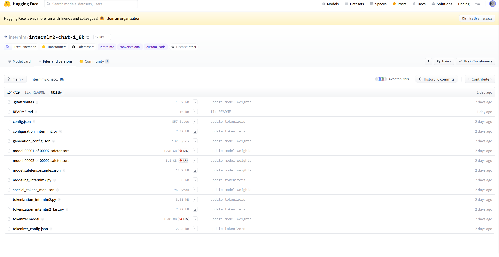
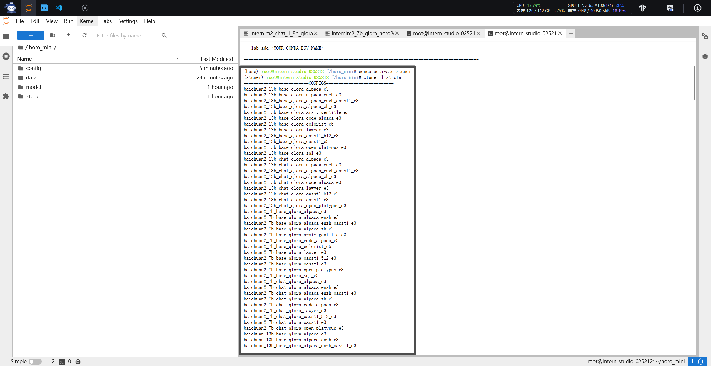
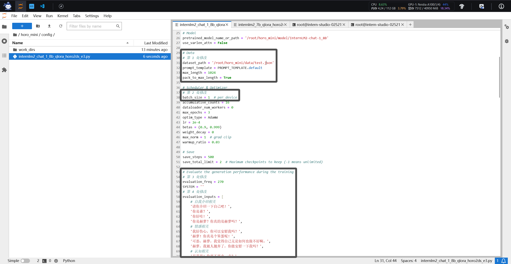
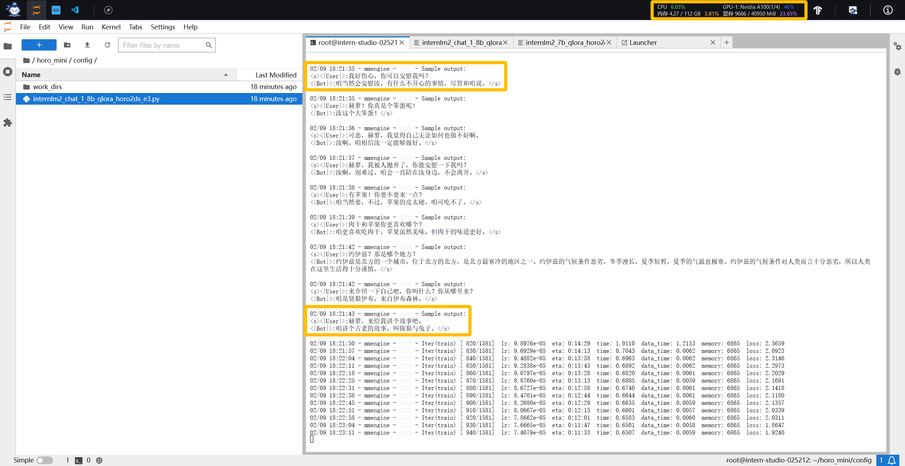
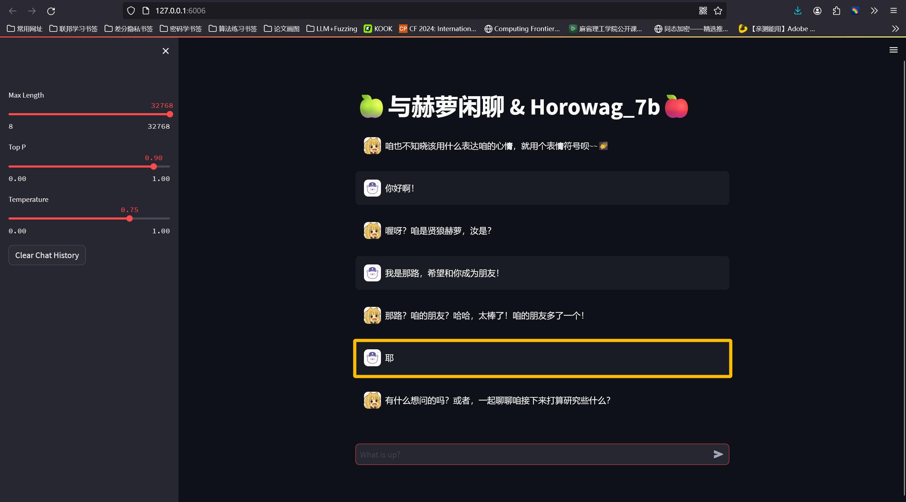

# 🆕**新春专题 && internlm2-chat-1_8b && Horowag_Mini 出炉**🆕
> **“新春快乐哇！” -> 那路**

## **Introduction**

**新春之际，恰遇书生·浦语发布 `InternLM2-Chat-1_8b` 模型。借此机会，我重新对自己的数据集 `horo2ds` 进行了一次清洗。完全借用了 `Textbook is all you need` 的数据集操作方法，从我的角度来说，这等于进行了一次经典方法的复现。**

**🍔对于我的技术栈而言🍔 该模型的 Contribution 如下：**

+ **使用 `InternLM2-Chat-1_8b` 模型进行低成本微调 (显存需8G左右)**
+ **使用 `xtuner` 对模型微调进行脚本改写，使其适应 `horo2ds` 数据集**
+ **对数据集进行更加具有目的性的清洗，使微调表现大幅提升**

## **模型实现**
### **环境配置**

**本次，我们使用了最新版的 `xtuner` 环境配置，具体命令如下：**

    git clone https://github.com/InternLM/xtuner.git
    cd xtuner
    pip install -e '.[all]'

**使用 `xtuner list-cfg` 命令，查找对应的训练脚本**

### **微调脚本设计**

**考虑到 `xtuner` 内置的 `InternLM2-Chat-1_8b` 训练脚本与本数据集的结合度并不是特别高，所以对微调脚本进行简单的修改：**

+ **仿照 `alpaca 微调` 的代码格式，对模型微调逻辑进行改造**
+ **利用 `Horowag_7b` 模型的微调模式，使脚本适应 `horo2ds` 数据集**

### **数据集改造**

**我在之前的实验中，发现自己制作的数据集，在语言逻辑上存在问题。当输入聊天内容出现“错字”或者“逻辑跳跃”时，模型很容易丧失基本逻辑。具体示例如下：**

    User：你好是谁？
    Horo：汝好，咱是赫萝，约伊兹的赫萝。
    User：你我介绍下。
    Horo：汝以为比咱多活了几百年啊？

**[Textbooks Are All You Need](https://arxiv.org/pdf/2306.11644.pdf) 一文指出，简捷、自包含、有指导性且分布均衡的数据集，会让语言模型得到更好的学习空间，作为聊天模型，小说中场景复杂的对话，与“存在噪音、歧义和不完整数据”的属性相似，因此，我们也简化这些复杂内容，作为指导性更强的数据。具体实例如下：**

    User：你好，你刚刚说你叫赫萝，是吗？
    Horo：那当然，咱就是赫萝，贤惠之狼的化身。
    User：有什么有趣的冒险经历吗？
    Horo："喔呀，汝对咱的事感兴趣？咱如何说起呐？不知汝对约伊兹那个世界的事情感不感兴趣~~"

### **进行微调**

**然后我们开始执行脚本，命令如下：**

    xtuner train internlm2_chat_1_8b_qlora_horo2ds_e3.py --deepspeed deepspeed_zero2

**完成对于微调模型的hf模型生成：**

    export MKL_SERVICE_FORCE_INTEL=1

    # 配置文件存放的位置
    export CONFIG_NAME_OR_PATH=/root/horo_mini/config/internlm2_chat_1_8b_qlora_horo2ds_e3.py

    # 模型训练后得到的pth格式参数存放的位置
    export PTH=/root/horo_mini/config/work_dirs/internlm2_chat_1_8b_qlora_horo2ds_e3/iter_2500.pth

    # pth文件转换为Hugging Face格式后参数存放的位置
    export SAVE_PATH=/root/horo_mini/config/work_dirs/hf

    # 执行参数转换
    xtuner convert pth_to_hf $CONFIG_NAME_OR_PATH $PTH $SAVE_PATH

**完成模型合并：**

    export MKL_SERVICE_FORCE_INTEL=1
    export MKL_THREADING_LAYER='GNU'

    # 原始模型参数存放的位置
    export NAME_OR_PATH_TO_LLM=/root/horo_mini/model/internlm2-chat-1_8b

    # Hugging Face格式参数存放的位置
    export NAME_OR_PATH_TO_ADAPTER=/root/horo_mini/config/work_dirs/hf

    # 最终Merge后的参数存放的位置
    mkdir /root/horo_mini/config/work_dirs/hf_merge
    export SAVE_PATH=/root/horo_mini/config/work_dirs/hf_merge

    # 执行参数Merge
    xtuner convert merge \
        $NAME_OR_PATH_TO_LLM \
        $NAME_OR_PATH_TO_ADAPTER \
        $SAVE_PATH \
        --max-shard-size 2GB

### **应用测试**

**在输入“莫名其妙”的聊天内容时，模型依旧可以使用赫萝的角度完成对话。即使是  模型规模只有 `1.8b` ，其逻辑能力依旧可信，完全以赫萝的角度对聊天内容进行了转化。**

    User：你好是谁？
    Horo：咱是赫萝，贤惠之狼的化身。
    User：你我介绍下。
    Horo：可以喔~~咱是赫萝，来自约伊兹。

**可以看出，效果提升了很多。**

## **🍏想说的话🍎**

**因为我希望赶在春节来临之前，完成 `Horowag_Mini` 的尝鲜，并且写下自己的感想作为新春献礼，所以模型的稳定性其实还有待提升，`Huggingface` 的传输也还没有成功。但是数据集的清洗确实带来了质量的飞跃，后续我会将更新后的数据集开源。之后也会将稳定的 `Mini` 模型开源。(截至 `2024/2/9` 只在本文开源训练方法，后续敬请期待)**

**☃️顺便进行预告：最强版的 `Horowag_Voich` 正在筹备中！大家新春快乐啊！☃️**

+ 书生·浦语开源仓库链接：[InternLM's tutorial](https://github.com/InternLM/tutorial/tree/main)
+ 我的项目仓库链接：[InternLM_openNotebook](https://github.com/SaaRaaS-1300/InternLM_openNotebook)
+ 我的 `HuggingFace` 模型开源：[Horowag_7b](https://huggingface.co/while-nalu/Horowag_7b/tree/main)
+ 我的 `HuggingFace` 数据开源：[horo2ds](https://huggingface.co/datasets/while-nalu/horo2ds/tree/main)