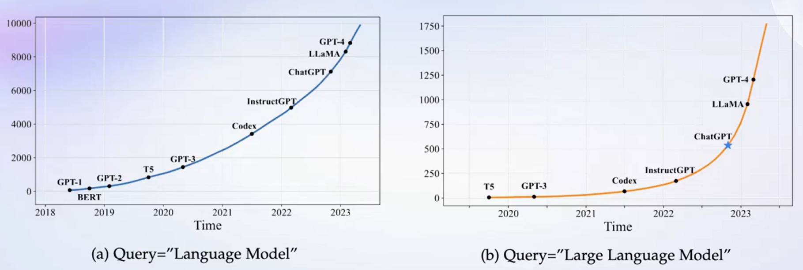
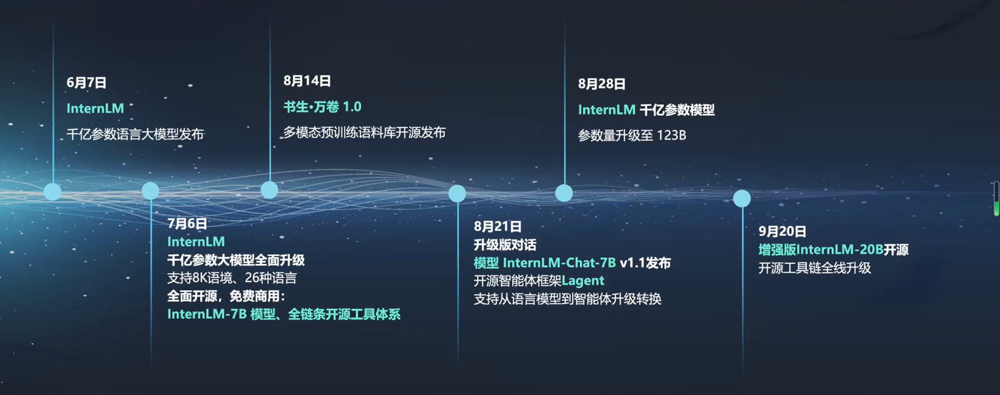
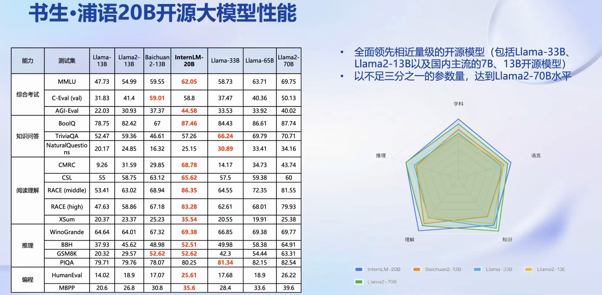

# 😀**书生·浦语(InternLM)-openLesson-1**😀
> **“有思想，也有忧伤和理想，这才是生活。” -> 陀思妥耶夫斯基**
## 大语言模型 && 热门关键词

大语言模型的关键词搜索热度在2023年快速上升

------
通用大模型的地位上升与其解决问题的能力“强相关”。其强大的表示能力使其能够处理复杂的语境和抽象特征，实现一个模型应对多种任务、多种模态的目标。同时，大语言模型的相关技术给予了我们“自定义模型”的可能，即预训练和迁移学习。这两种技术让大模型能够在不同领域中学到通用特征，提高了效率且促进了任务之间的知识传递，无形中淘汰了很多领域的“专用模型”。

## 书生·浦语的开源路线

## 书生·浦语的性能分析

