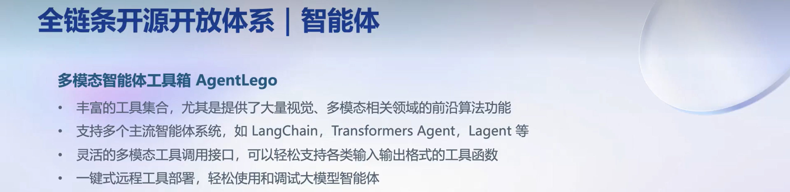

# 😀**书生·浦语(InternLM)-openLesson-1**😀
> **“有思想，也有忧伤和理想，这才是生活。” -> 陀思妥耶夫斯基**
## 大语言模型 && 热门关键词

大语言模型的关键词搜索热度在2023年快速上升

------
通用大模型的地位上升与其解决问题的能力“强相关”。其强大的表示能力使其能够处理复杂的语境和抽象特征，实现一个模型应对多种任务、多种模态的目标。同时，大语言模型的相关技术给予了我们“自定义模型”的可能，即预训练和迁移学习。这两种技术让大模型能够在不同领域中学到通用特征，提高了效率且促进了任务之间的知识传递，无形中淘汰了很多领域的“专用模型”。

## 书生·浦语的开源路线

## 书生·浦语的性能分析

书生·浦语大模型在多数数据测试集之中都处于领先地位，其中以阅读理解最为突出。这主要源于语言模型的卓越表示学习能力和大规模预训练的优势，合理调制的参数量使其能够更好地理解“语言文本信息”。我认为，文本多以文章信息提取作为重点，书生·浦语从应用角度突出了优势，日后应用可以尝试偏重于“理解能力”从而获得良好的效果反馈。

## 书生·浦语的应用方法

对于应用相关的能力，该模型具备以下条件：
1. "2TB"的多模态任务数据(训练集)
2. 并行预训练系统
3. XTuner同时支持全参数微调和LoRA低成本微调
4. 全链路部署
5. 全方位评测，40多万道题目以供测试选择
6. 支持多智能体等工具

## 书生·浦语的智能体应用举例

## 小结

这部分课程是Overview，后续会针对不同任务进行具体操作。