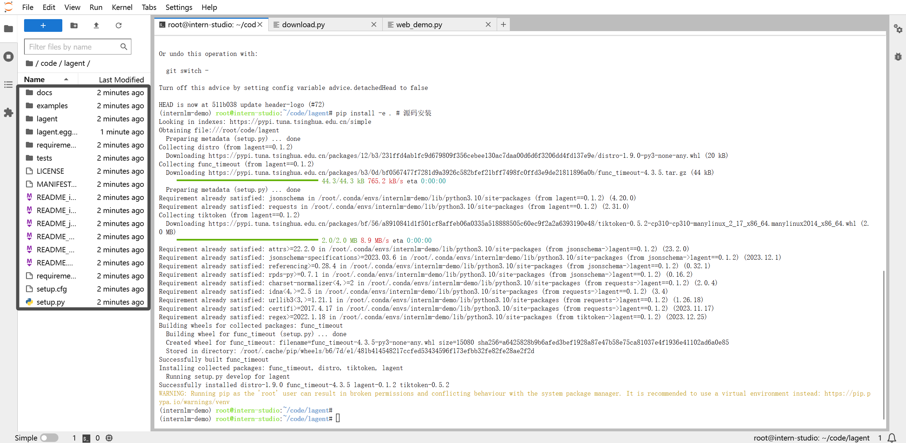

# 😎**书生·浦语(InternLM)-openLesson-2**😎
> **“倘若你想征服世界，你就得征服你自己。” -> 陀思妥耶夫斯基**
## **使用书生·浦语完成LLM的(“Hello World”)**

大模型的定义是非常简单的，即“人工智能领域中参数数量巨大、拥有庞大计算能力和参数规模的模型。”其特点及应用分为三个主体：

1. 利用大量数据进行训练
2. 拥有数十亿甚至数千亿个参数
3. 模型在各种任务中展现出惊人的性能 <- **个人认为这句话实际上不太合适,多数情况下大语言模型能表现出强大的泛化能力，但不一定是针对某个特定任务的专业能力，这是与专用模型相区别的**

## **InternLM-Chat-7B 智能对话 Demo**

基础目标：
+ 使用 InternLM-Chat-7B 模型生成 300 字的小故事
+ 熟悉 hugging face 下载功能，使用 huggingface_hub python 包，下载 InternLM-20B 的 config.json 文件到本地

### InternLM-Chat-7B 模型 && 小故事
#### (1) 环境准备
**在 InternStudio 平台中选择 A100(1/4) 的配置，如下图所示镜像选择 Cuda11.7-conda，如下图所示：**

**进入 conda 环境之后，使用以下命令从本地克隆一个已有的 pytorch 2.0.1 的环境**

    bash # 请每次使用 jupyter lab 打开终端时务必先执行 bash 命令进入 bash 中
    conda create --name internlm-demo --clone=/root/share/conda_envs/internlm-base

**然后使用以下命令激活环境**

    conda activate internlm-demo

**并在环境中安装运行 demo 所需要的依赖。**

    python -m pip install --upgrade pip

    pip install modelscope==1.9.5
    pip install transformers==4.35.2
    pip install streamlit==1.24.0
    pip install sentencepiece==0.1.99
    pip install accelerate==0.24.1

#### (2) 模型下载

**InternStudio 平台的 share 目录下已经为我们准备了全系列的 InternLM 模型，所以我们可以直接复制即可。使用如下命令复制：**

    mkdir -p /root/model/Shanghai_AI_Laboratory
    cp -r /root/share/temp/model_repos/internlm-chat-7b /root/model/Shanghai_AI_Laboratory

**也可以使用比较通用的方法(推荐)：在 /root 路径下新建目录 model，在目录下新建 download.py 文件并在其中输入以下内容，粘贴代码后记得保存文件，如下图所示。并运行 python /root/model/download.py 执行下载，模型大小为 14 GB，下载模型大概需要 10~20 分钟，具体代码如下：**

    import torch
    from modelscope import snapshot_download, AutoModel, AutoTokenizer
    import os
    model_dir = snapshot_download('Shanghai_AI_Laboratory/internlm-chat-7b', cache_dir='/root/model', revision='v1.0.3')

#### (3) 代码准备

**首先 clone 代码，在 /root 路径下新建 code 目录，然后切换路径, clone 代码。**

    cd /root/code
    git clone https://gitee.com/internlm/InternLM.git

**切换 commit 版本，与教程 commit 版本保持一致，可以让大家更好的复现。**

    cd InternLM
    git checkout 3028f07cb79e5b1d7342f4ad8d11efad3fd13d17

#### (4) Terminal Demo

    import torch
    from transformers import AutoTokenizer, AutoModelForCausalLM

    model_name_or_path = "/root/model/Shanghai_AI_Laboratory/internlm-chat-7b"

    tokenizer = AutoTokenizer.from_pretrained(model_name_or_path, trust_remote_code=True)
    model = AutoModelForCausalLM.from_pretrained(model_name_or_path, trust_remote_code=True, torch_dtype=torch.bfloat16, device_map='auto')
    model = model.eval()

    system_prompt = """You are an AI assistant whose name is InternLM (书生·浦语).
    - InternLM (书生·浦语) is a conversational language model that is developed by Shanghai AI Laboratory (上海人工智能实验室). It is designed to be helpful, honest, and harmless.
    - InternLM (书生·浦语) can understand and communicate fluently in the language chosen by the user such as English and 中文.
    """

    messages = [(system_prompt, '')]

    print("=============Welcome to InternLM chatbot, type 'exit' to exit.=============")

    while True:
        input_text = input("User  >>> ")
        input_text = input_text.replace(' ', '')
        if input_text == "exit":
            break
        response, history = model.chat(tokenizer, input_text, history=messages)
        messages.append((input_text, response))
        print(f"robot >>> {response}")

#### (5) Web Demo

**运行 /root/code/InternLM 目录下的 web_demo.py 文件，输入以下命令后，配置本地端口，将端口映射到本地。在本地浏览器输入 http://127.0.0.1:6006 即可。**

    bash
    conda activate internlm-demo  
    # 首次进入 vscode 会默认是 base 环境，所以首先切换环境
    cd /root/code/InternLM
    streamlit run web_demo.py --server.address 127.0.0.1 --server.port 6006

#### (6) 目标效果呈现 - 故事编写

### 关于 hugging face 的相关使用方法
#### (1) Hugging Face 

**使用 Hugging Face 官方提供的 huggingface-cli 命令行工具。安装依赖:**

    pip install -U huggingface_hub

**然后新建 python 文件，填入以下代码，运行即可。**

---
* resume-download：断点续下
* local-dir：本地存储路径。（linux 环境下需要填写绝对路径）
---

    import os
    # 下载模型
    os.system('huggingface-cli download --resume-download internlm/internlm-chat-7b --local-dir your_path')

**以下内容将展示使用 huggingface_hub 下载模型中的部分文件**

    import os 
    from huggingface_hub import hf_hub_download  # Load model directly 

    hf_hub_download(repo_id="internlm/internlm-7b", filename="config.json")

#### (2) ModelScope

**使用 modelscope 中的 snapshot_download 函数下载模型，第一个参数为模型名称，参数 cache_dir 为模型的下载路径。(注意：cache_dir 最好为绝对路径)**

**安装依赖：**

    pip install modelscope==1.9.5
    pip install transformers==4.35.2

**在当前目录下新建 python 文件，填入以下代码，运行即可。**

    import torch
    from modelscope import snapshot_download, AutoModel, AutoTokenizer
    import os
    model_dir = snapshot_download('Shanghai_AI_Laboratory/internlm-chat-7b', cache_dir='your path', revision='master')

#### (3) 目标效果呈现 - 下载相关模型

---

>😀**至此，基础任务已经完成**😀

## **Lagent 智能体工具调用 Demo**

### Lagent 安装
**首先切换路径到 /root/code 克隆 lagent 仓库，并通过 "pip install -e ." 源码安装 Lagent**

    cd /root/code
    git clone https://gitee.com/internlm/lagent.git
    cd /root/code/lagent
    git checkout 511b03889010c4811b1701abb153e02b8e94fb5e 
    # 尽量保证和教程commit版本一致
    pip install -e . # 源码安装

**我们可以参考同样的方法，切换到 VScode 页面，运行成功后，配置本地端口，将端口映射到本地。在本地浏览器输入 http://127.0.0.1:6006 即可。

    streamlit run /root/code/lagent/examples/react_web_demo.py --server.address 127.0.0.1 --server.port 6006

### Demo 运行效果

