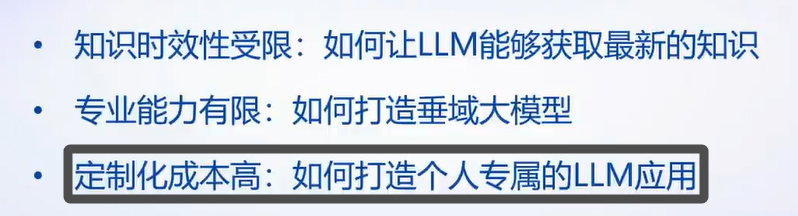
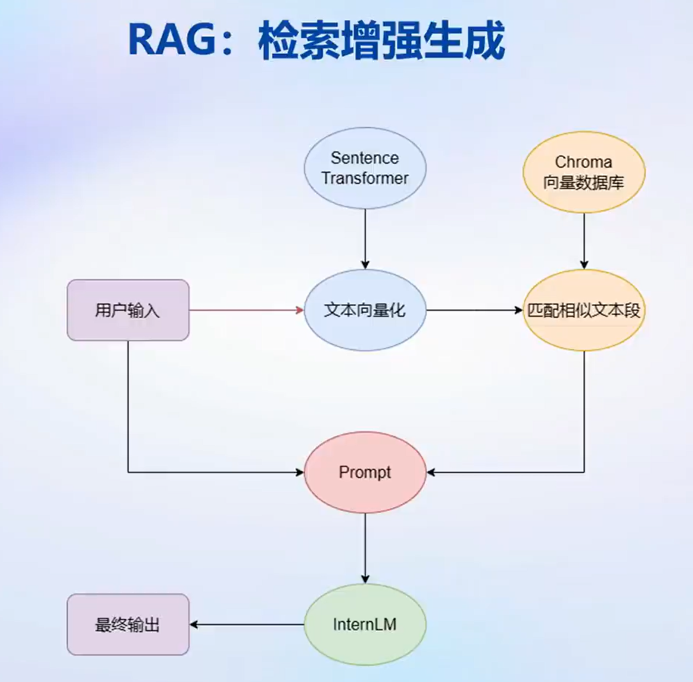
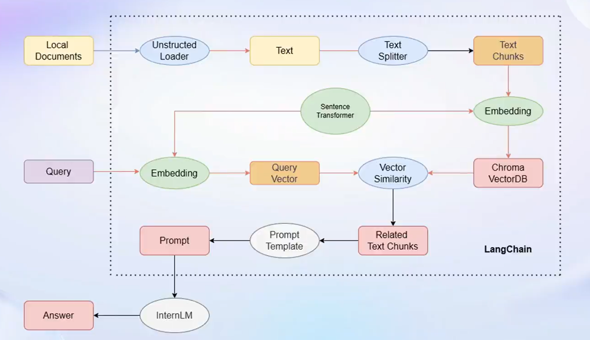
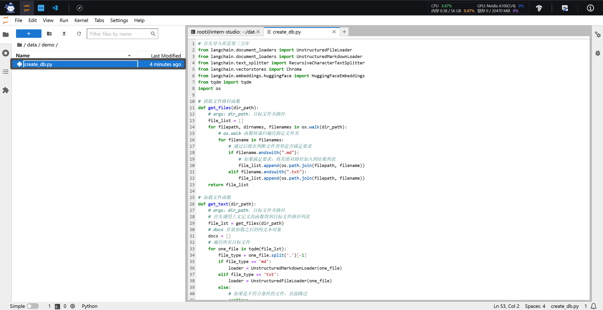

# 😝**书生·浦语(InternLM)-openLesson-2**😝
> **“生命不管在哪里总是生命，生命在我们自己身上，而不是在外部。” -> 陀思妥耶夫斯基**
## **基于 InternLM 和 LangChain 搭建知识库**
### **Introduction**

---
+ **LLM 存在诸多局限，定制化成本高昂是亟待解决的核心问题**
+ **可以尝试引入 Langchain 帮助大模型解决知识库方面的不足**
---

**Prompt 是一个很有价值的突破口，利用其完成检索增强任务，将会有效解决大语言模型知识上的漏洞。通过设计精准的提示（Prompt），我们可以引导模型更准确地回答问题、生成内容，弥补大语言模型在某些情境下可能存在的理解或输出偏差。检索增强任务利用 Prompt 的方式，可以使模型更有针对性地从丰富的知识库中检索信息，提高对特定主题或领域的了解和应用。这种方法不仅有助于提高模型的知识覆盖面，还能够促使模型更好地理解上下文，缩小与真实世界场景的鸿沟。因此，通过巧妙地利用 Prompt 进行检索增强任务，我们能够更全面、准确地利用大语言模型的潜力，为解决知识上的漏洞提供创新性的解决方案。**

### **认识 LangChain**

**Langchain 框架是一个开源工具，通过为各种LLM提供通用接口来简化应用程序的开发流程，帮助开发者自由构建 LLM 应用。**

### **构建向量数据库**

+ **确定源文件类型，针对不同类型源文件选用不同的加载器**
+ **由于单个文档往往超过模型上下限，所以要对加载的文档进行切分**
+ **使用向量数据库来支持语义检索，需要将文档向量化存入向量数据库**

#### (1) 环境配置

**在已完成 InternLM 的部署基础上，还需要安装以下依赖包：**

    pip install langchain==0.0.292
    pip install gradio==4.4.0
    pip install chromadb==0.4.15
    pip install sentence-transformers==2.2.2
    pip install unstructured==0.10.30
    pip install markdown==3.3.7

**同时，我们需要使用到开源词向量模型 Sentence Transformer:（我们也可以选用别的开源词向量模型来进行 Embedding，目前选用这个模型是相对轻量、支持中文且效果较好的，同学们可以自由尝试别的开源词向量模型）**

**首先需要使用 huggingface 官方提供的 huggingface-cli 命令行工具。安装依赖:**

    pip install -U huggingface_hub

**然后在和 /root/data 目录下新建python文件 download_hf.py，填入以下代码：**

    import os

    # 下载模型
    os.system('huggingface-cli download --resume-download sentence-transformers/paraphrase-multilingual-MiniLM-L12-v2 --local-dir /root/data/model/sentence-transformer')

**但是，使用 huggingface 下载可能速度较慢，我们可以使用 huggingface 镜像下载。与使用hugginge face下载相同，只需要填入镜像地址即可。将 download_hf.py 中的代码修改为以下代码：**

    import os

    # 设置环境变量
    os.environ['HF_ENDPOINT'] = 'https://hf-mirror.com'

    # 下载模型
    os.system('huggingface-cli download --resume-download sentence-transformers/paraphrase-multilingual-MiniLM-L12-v2 --local-dir /root/data/model/sentence-transformer')

**然后，在 /root/data 目录下执行该脚本即可自动开始下载：**

    python download_hf.py

**我们用以下命令下载 “nltk” 资源并解压到服务器上：**

    cd /root
    git clone https://gitee.com/yzy0612/nltk_data.git  --branch gh-pages
    cd nltk_data
    mv packages/*  ./
    cd tokenizers
    unzip punkt.zip
    cd ../taggers
    unzip averaged_perceptron_tagger.zip

**之后使用时服务器即会自动使用已有资源，无需再次下载。**

#### (2) 数据收集

**我们选择由上海人工智能实验室开源的一系列大模型工具开源仓库作为语料库来源，包括：**

+ OpenCompass：面向大模型评测的一站式平台
+ IMDeploy：涵盖了 LLM 任务的全套轻量化、部署和服务解决方案的高效推理工具箱
+ XTuner：轻量级微调大语言模型的工具库
+ InternLM-XComposer：浦语·灵笔，基于书生·浦语大语言模型研发的视觉-语言大模型
+ Lagent：一个轻量级、开源的基于大语言模型的智能体（agent）框架
+ InternLM：一个开源的轻量级训练框架，旨在支持大模型训练而无需大量的依赖

**首先我们需要将上述远程开源仓库 Clone 到本地，可以使用以下命令：**

    # 进入到数据库盘
    cd /root/data
    # clone 上述开源仓库
    git clone https://gitee.com/open-compass/opencompass.git
    git clone https://gitee.com/InternLM/lmdeploy.git
    git clone https://gitee.com/InternLM/xtuner.git
    git clone https://gitee.com/InternLM/InternLM-XComposer.git
    git clone https://gitee.com/InternLM/lagent.git
    git clone https://gitee.com/InternLM/InternLM.git

**接着，为语料处理方便，我们将选用上述仓库中所有的 markdown、txt 文件作为示例语料库。注意，也可以选用其中的代码文件加入到知识库中，但需要针对代码文件格式进行额外处理(因为代码文件对逻辑联系要求较高，且规范性较强，在分割时最好基于代码模块进行分割再加入向量数据库)。我们首先将上述仓库中所有满足条件的文件路径找出来，我们定义一个函数，该函数将递归指定文件夹路径，返回其中所有满足条件（即后缀名为 .md 或者 .txt 的文件）的文件路径：**

    import os 
    def get_files(dir_path):
        # args：dir_path，目标文件夹路径
        file_list = []
        for filepath, dirnames, filenames in os.walk(dir_path):
            # os.walk 函数将递归遍历指定文件夹
            for filename in filenames:
                # 通过后缀名判断文件类型是否满足要求
                if filename.endswith(".md"):
                    # 如果满足要求，将其绝对路径加入到结果列表
                    file_list.append(os.path.join(filepath, filename))
                elif filename.endswith(".txt"):
                    file_list.append(os.path.join(filepath, filename))
        return file_list

#### (3) 加载数据并构建数据库

**需求代码如下：**

    from tqdm import tqdm
    from langchain.document_loaders import UnstructuredFileLoader
    from langchain.document_loaders import UnstructuredMarkdownLoader

    def get_text(dir_path):
        # args：dir_path，目标文件夹路径
        # 首先调用上文定义的函数得到目标文件路径列表
        file_lst = get_files(dir_path)
        # docs 存放加载之后的纯文本对象
        docs = []
        # 遍历所有目标文件
        for one_file in tqdm(file_lst):
            file_type = one_file.split('.')[-1]
            if file_type == 'md':
                loader = UnstructuredMarkdownLoader(one_file)
            elif file_type == 'txt':
                loader = UnstructuredFileLoader(one_file)
            else:
                # 如果是不符合条件的文件，直接跳过
                continue
            docs.extend(loader.load())
        return docs

**得到该列表之后，我们就可以将它引入到 LangChain 框架中构建向量数据库。由纯文本对象构建向量数据库，我们需要先对文本进行分块，接着对文本块进行向量化。 LangChain 提供了多种文本分块工具，此处我们使用字符串递归分割器，并选择分块大小为 500，块重叠长度为 150（由于篇幅限制，此处没有展示切割效果，学习者可以自行尝试一下，想要深入学习 LangChain 文本分块可以参考教程 《LangChain - Chat With Your Data》：**

    from langchain.text_splitter import RecursiveCharacterTextSplitter

    text_splitter = RecursiveCharacterTextSplitter(
        chunk_size=500, chunk_overlap=150)
    split_docs = text_splitter.split_documents(docs)

**接着我们选用开源词向量模型 Sentence Transformer 来进行文本向量化。LangChain 提供了直接引入 HuggingFace 开源社区中的模型进行向量化的接口：**

    from langchain.embeddings.huggingface import HuggingFaceEmbeddings

    embeddings = HuggingFaceEmbeddings(model_name="/root/data/model/sentence-transformer")

**同时，考虑到 Chroma 是目前最常用的入门数据库，我们选择 Chroma 作为向量数据库，基于上文分块后的文档以及加载的开源向量化模型，将语料加载到指定路径下的向量数据库：**

    from langchain.vectorstores import Chroma

    # 定义持久化路径
    persist_directory = 'data_base/vector_db/chroma'
    # 加载数据库
    vectordb = Chroma.from_documents(
        documents=split_docs,
        embedding=embeddings,
        persist_directory=persist_directory  # 允许我们将persist_directory目录保存到磁盘上
    )
    # 将加载的向量数据库持久化到磁盘上
    vectordb.persist()

#### (4) InternLM 接入 LangChain

**将向量数据库到文档切片，再到自定义 LLM 总结起来的代码为：**

    from langchain.llms.base import LLM
    from typing import Any, List, Optional
    from langchain.callbacks.manager import CallbackManagerForLLMRun
    from transformers import AutoTokenizer, AutoModelForCausalLM
    import torch

    class InternLM_LLM(LLM):
        # 基于本地 InternLM 自定义 LLM 类
        tokenizer : AutoTokenizer = None
        model: AutoModelForCausalLM = None

        def __init__(self, model_path :str):
            # model_path: InternLM 模型路径
            # 从本地初始化模型
            super().__init__()
            print("正在从本地加载模型...")
            self.tokenizer = AutoTokenizer.from_pretrained(model_path, trust_remote_code=True)
            self.model = AutoModelForCausalLM.from_pretrained(model_path, trust_remote_code=True).to(torch.bfloat16).cuda()
            self.model = self.model.eval()
            print("完成本地模型的加载")

        def _call(self, prompt : str, stop: Optional[List[str]] = None,
                    run_manager: Optional[CallbackManagerForLLMRun] = None,
                    **kwargs: Any):
            # 重写调用函数
            system_prompt = """You are an AI assistant whose name is InternLM (书生·浦语).
            - InternLM (书生·浦语) is a conversational language model that is developed by Shanghai AI Laboratory (上海人工智能实验室). It is designed to be helpful, honest, and harmless.
            - InternLM (书生·浦语) can understand and communicate fluently in the language chosen by the user such as English and 中文.
            """
            
            messages = [(system_prompt, '')]
            response, history = self.model.chat(self.tokenizer, prompt , history=messages)
            return response
            
        @property
        def _llm_type(self) -> str:
            return "InternLM"

#### (5) 构建检索问答链
**LangChain 通过提供检索问答链对象来实现对于 RAG 全流程的封装。所谓检索问答链，即通过一个对象完成检索增强问答（即RAG）的全流程，针对 RAG 的更多概念，我们会在视频内容中讲解，也欢迎读者查阅该教程来进一步了解：《LLM Universe》。我们可以调用一个 LangChain 提供的 RetrievalQA 对象，通过初始化时填入已构建的数据库和自定义 LLM 作为参数，来简便地完成检索增强问答的全流程，LangChain 会自动完成基于用户提问进行检索、获取相关文档、拼接为合适的 Prompt 并交给 LLM 问答的全部流程。**

    from langchain.vectorstores import Chroma
    from langchain.embeddings.huggingface import HuggingFaceEmbeddings
    import os

    # 定义 Embeddings
    embeddings = HuggingFaceEmbeddings(model_name="/root/data/model/sentence-transformer")

    # 向量数据库持久化路径
    persist_directory = 'data_base/vector_db/chroma'

    # 加载数据库
    vectordb = Chroma(
        persist_directory=persist_directory, 
        embedding_function=embeddings
    )

**上述代码得到的 vectordb 对象即为我们已构建的向量数据库对象，该对象可以针对用户的 query 进行语义向量检索，得到与用户提问相关的知识片段。接着，我们实例化一个基于 InternLM 自定义的 LLM 对象：**

    from LLM import InternLM_LLM
    llm = InternLM_LLM(model_path = "/root/data/model/Shanghai_AI_Laboratory/internlm-chat-7b")
    llm.predict("你是谁")

**构建检索问答链，还需要构建一个 Prompt Template，该 Template 其实基于一个带变量的字符串，在检索之后，LangChain 会将检索到的相关文档片段填入到 Template 的变量中，从而实现带知识的 Prompt 构建。我们可以基于 LangChain 的 Template 基类来实例化这样一个 Template 对象：**

    from langchain.prompts import PromptTemplate

    # 我们所构造的 Prompt 模板
    template = """使用以下上下文来回答用户的问题。如果你不知道答案，就说你不知道。总是使用中文回答。
    问题: {question}
    可参考的上下文：
    ···
    {context}
    ···
    如果给定的上下文无法让你做出回答，请回答你不知道。
    有用的回答:"""

    # 调用 LangChain 的方法来实例化一个 Template 对象，该对象包含了 context 和 question 两个变量，在实际调用时，这两个变量会被检索到的文档片段和用户提问填充
    QA_CHAIN_PROMPT = PromptTemplate(input_variables=["context","question"],template=template)
    4.3 构建检索问答链
    最后，可以调用 LangChain 提供的检索问答链构造函数，基于我们的自定义 LLM、Prompt Template 和向量知识库来构建一个基于 InternLM 的检索问答链：

    from langchain.chains import RetrievalQA

    qa_chain = RetrievalQA.from_chain_type(llm,retriever=vectordb.as_retriever(),return_source_documents=True,chain_type_kwargs={"prompt":QA_CHAIN_PROMPT})

**得到的 qa_chain 对象即可以实现我们的核心功能，即基于 InternLM 模型的专业知识库助手。我们可以对比该检索问答链和纯 LLM 的问答效果：**

    # 检索问答链回答效果
    question = "什么是InternLM"
    result = qa_chain({"query": question})
    print("检索问答链回答 question 的结果：")
    print(result["result"])

    # 仅 LLM 回答效果
    result_2 = llm(question)
    print("大模型回答 question 的结果：")
    print(result_2)

#### (6) 部署 Web Demo
**在完成上述核心功能后，我们可以基于 Gradio 框架将其部署到 Web 网页，从而搭建一个小型 Demo，便于测试与使用。我们首先将上文的代码内容封装为一个返回构建的检索问答链对象的函数，并在启动 Gradio 的第一时间调用该函数得到检索问答链对象，后续直接使用该对象进行问答对话，从而避免重复加载模型：**

    from langchain.vectorstores import Chroma
    from langchain.embeddings.huggingface import HuggingFaceEmbeddings
    import os
    from LLM import InternLM_LLM
    from langchain.prompts import PromptTemplate
    from langchain.chains import RetrievalQA

    def load_chain():
        # 加载问答链
        # 定义 Embeddings
        embeddings = HuggingFaceEmbeddings(model_name="/root/data/model/sentence-transformer")

        # 向量数据库持久化路径
        persist_directory = 'data_base/vector_db/chroma'

        # 加载数据库
        vectordb = Chroma(
            persist_directory=persist_directory,  # 允许我们将persist_directory目录保存到磁盘上
            embedding_function=embeddings
        )

        # 加载自定义 LLM
        llm = InternLM_LLM(model_path = "/root/data/model/Shanghai_AI_Laboratory/internlm-chat-7b")

        # 定义一个 Prompt Template
        template = """使用以下上下文来回答最后的问题。如果你不知道答案，就说你不知道，不要试图编造答
        案。尽量使答案简明扼要。总是在回答的最后说“谢谢你的提问！”。
        {context}
        问题: {question}
        有用的回答:"""

        QA_CHAIN_PROMPT = PromptTemplate(input_variables=["context","question"],template=template)

        # 运行 chain
        qa_chain = RetrievalQA.from_chain_type(llm,retriever=vectordb.as_retriever(),return_source_documents=True,chain_type_kwargs={"prompt":QA_CHAIN_PROMPT})
        
        return qa_chain

**接着我们定义一个类，该类负责加载并存储检索问答链，并响应 Web 界面里调用检索问答链进行回答的动作：**

    class Model_center():
        """
        存储检索问答链的对象 
        """
        def __init__(self):
            # 构造函数，加载检索问答链
            self.chain = load_chain()

        def qa_chain_self_answer(self, question: str, chat_history: list = []):
            """
            调用问答链进行回答
            """
            if question == None or len(question) < 1:
                return "", chat_history
            try:
                chat_history.append(
                    (question, self.chain({"query": question})["result"]))
                # 将问答结果直接附加到问答历史中，Gradio 会将其展示出来
                return "", chat_history
            except Exception as e:
                return e, chat_history

**然后我们只需按照 Gradio 的框架使用方法，实例化一个 Web 界面并将点击动作绑定到上述类的回答方法即可：**

    import gradio as gr

    # 实例化核心功能对象
    model_center = Model_center()
    # 创建一个 Web 界面
    block = gr.Blocks()
    with block as demo:
        with gr.Row(equal_height=True):   
            with gr.Column(scale=15):
                # 展示的页面标题
                gr.Markdown("""<h1>
InternLM
</h1>
                    
书生浦语

                    """)

        with gr.Row():
            with gr.Column(scale=4):
                # 创建一个聊天机器人对象
                chatbot = gr.Chatbot(height=450, show_copy_button=True)
                # 创建一个文本框组件，用于输入 prompt。
                msg = gr.Textbox(label="Prompt/问题")

                with gr.Row():
                    # 创建提交按钮。
                    db_wo_his_btn = gr.Button("Chat")
                with gr.Row():
                    # 创建一个清除按钮，用于清除聊天机器人组件的内容。
                    clear = gr.ClearButton(
                        components=[chatbot], value="Clear console")
                    
            # 设置按钮的点击事件。当点击时，调用上面定义的 qa_chain_self_answer 函数，并传入用户的消息和聊天历史记录，然后更新文本框和聊天机器人组件。
            db_wo_his_btn.click(model_center.qa_chain_self_answer, inputs=[
                                msg, chatbot], outputs=[msg, chatbot])

        gr.Markdown("""提醒： 
        1. 初始化数据库时间可能较长，请耐心等待。
        2. 使用中如果出现异常，将会在文本输入框进行展示，请不要惊慌。  
        """)
    gr.close_all()
    # 直接启动
    demo.launch()

### **具体效果检验**

---
+ **通过上述步骤，先写出构建向量数据库的代码 construct.py**

---

