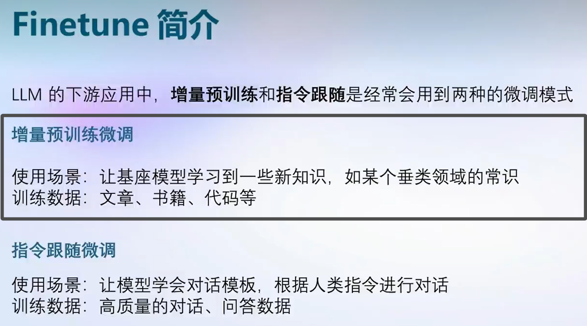
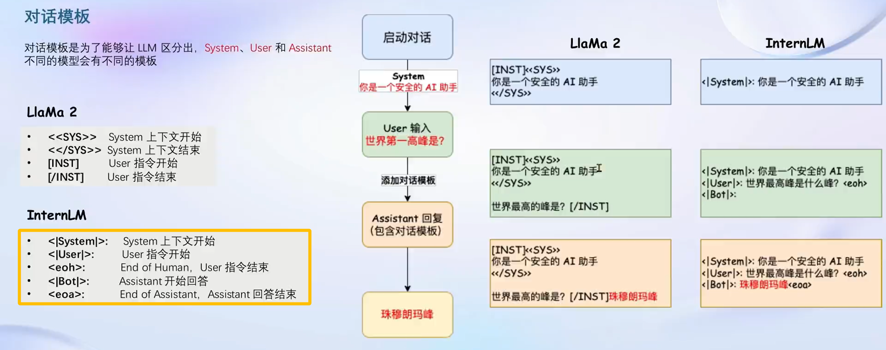
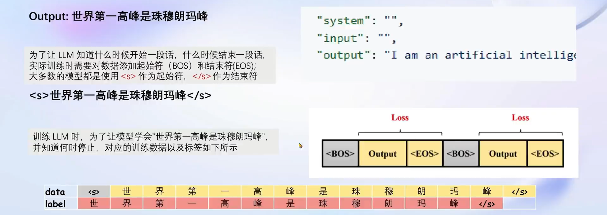
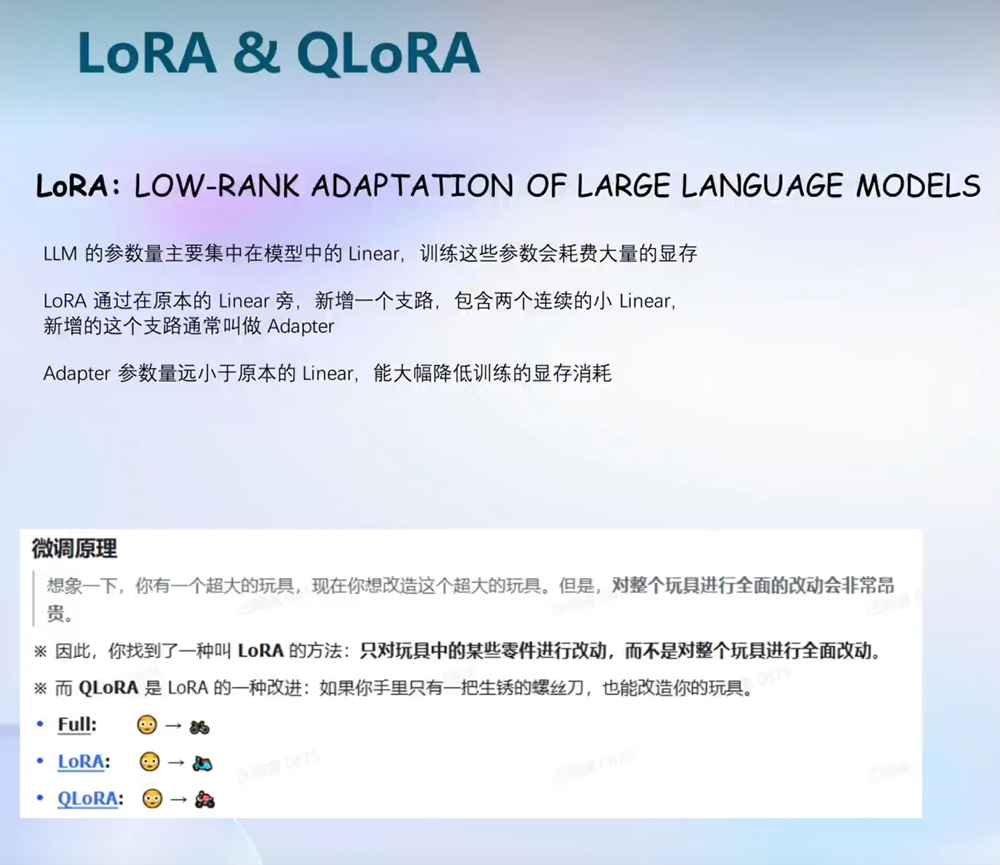
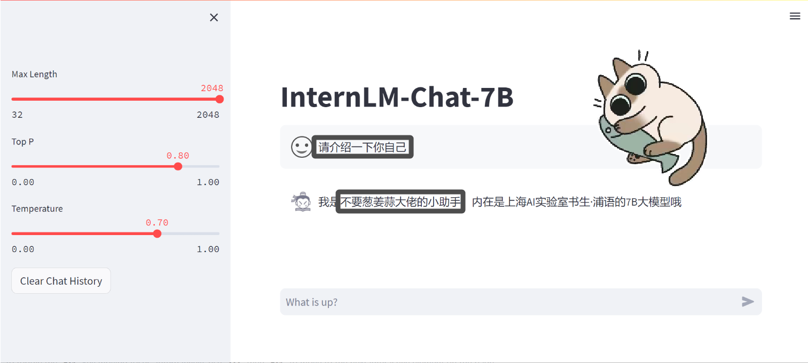
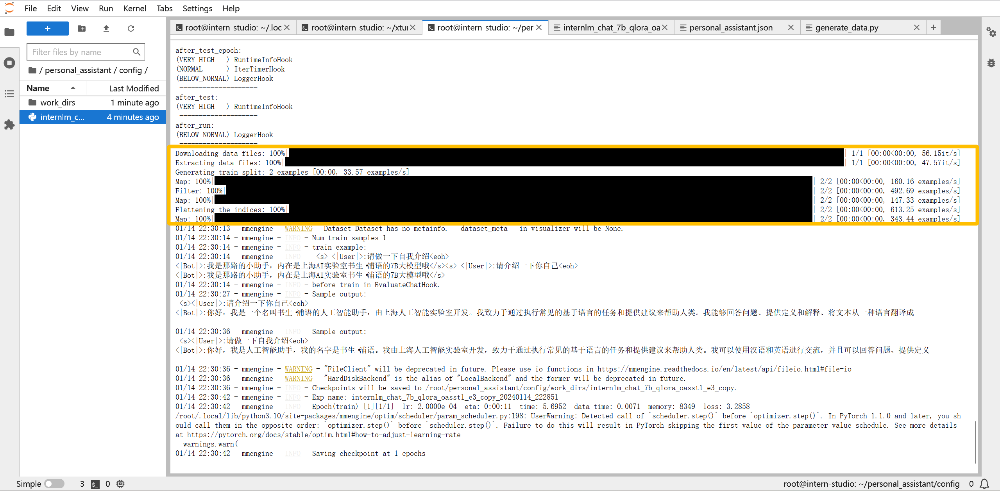
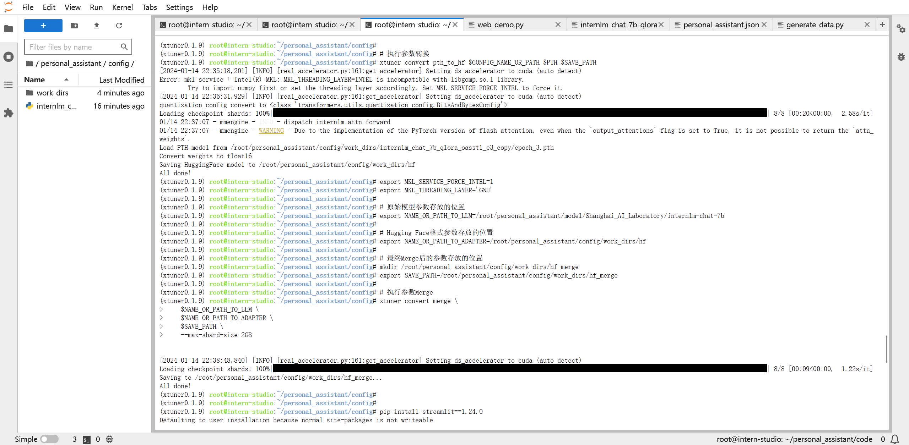

# 😵‍💫**书生·浦语(InternLM)-openLesson-4**😵‍💫
> **“我不忧伤，也不泄气。” -> 陀思妥耶夫斯基**
## **XTuner 大模型单卡低成本微调实战**
### **解析对话模板与指令微调**

**在实际对话中，通常有三种角色：**
+ **System：给定一些上下文信息**
+ **User：实际用户，会提出一些问题**
+ **Assistant：根据User的输入，结合System的上下文信息，做出回答**
---

**不同于增量预训练微调，指令跟随微调数据中会有 Input 和 Output 希望模型学会的是答案(Output)而不是问题(Input)，训练时只会对答案部分计算Loss。训练时，回合推理保持一直，对数据添加相应的对话模板。**

---

**增量数据微调最终要的不同在于：“让LLM知道什么时候开始一段话，什么时候结束一段话。”**

### **LoRA & QLoRA**

### **快速上手**

    # 如果你是在 InternStudio 平台，则从本地 clone 一个已有 pytorch 2.0.1 的环境：
    /root/share/install_conda_env_internlm_base.sh xtuner0.1.9
    # 如果你是在其他平台：
    conda create --name xtuner0.1.9 python=3.10 -y

    # 激活环境
    conda activate xtuner0.1.9
    # 进入家目录 （~的意思是 “当前用户的home路径”）
    cd ~
    # 创建版本文件夹并进入，以跟随本教程
    mkdir xtuner019 && cd xtuner019

    # 拉取 0.1.9 的版本源码
    git clone -b v0.1.9  https://github.com/InternLM/xtuner
    # 无法访问github的用户请从 gitee 拉取:
    # git clone -b v0.1.9 https://gitee.com/Internlm/xtuner

    # 进入源码目录
    cd xtuner

    # 从源码安装 XTuner
    pip install -e '.[all]'

**准备在 oasst1 数据集上微调 internlm-7b-chat**

    # 创建一个微调 oasst1 数据集的工作路径，进入
    mkdir ~/ft-oasst1 && cd ~/ft-oasst1

### **配置与微调**

**XTuner 提供多个开箱即用的配置文件，用户可以通过下列命令查看：**

    # 列出所有内置配置
    xtuner list-cfg

**拷贝一个配置文件到当前目录：**

    # xtuner copy-cfg ${CONFIG_NAME} ${SAVE_PATH}

**在本案例中即：（注意最后有个英文句号，代表复制到当前路径）**

    cd ~/ft-oasst1
    xtuner copy-cfg internlm_chat_7b_qlora_oasst1_e3 .

**配置文件名的解释：**

    xtuner copy-cfg internlm_chat_7b_qlora_oasst1_e3 .

| 模型名 | internlm_chat_7b |
|-------|-------|
| 使用算法 | qlora |
| 数据集 | oasst1 |
| 把数据集跑几次| 跑3次：e3 (epoch 3 ) |

无 chat比如 internlm-7b 代表是基座(base)模型

### **模型与数据集**

    # 创建一个目录，放模型文件，防止散落一地
    mkdir ~/ft-oasst1/internlm-chat-7b

    # 装一下拉取模型文件要用的库
    pip install modelscope

    # 从 modelscope 下载下载模型文件
    cd ~/ft-oasst1
    apt install git git-lfs -y
    git lfs install
    git lfs clone https://modelscope.cn/Shanghai_AI_Laboratory/internlm-chat-7b.git -b v1.0.3

https://huggingface.co/datasets/timdettmers/openassistant-guanaco/tree/main

**由于 huggingface 网络问题，将以下指令复制到正确位置即可(教学平台)：**

    cd ~/ft-oasst1
    # ...-guanaco 后面有个空格和英文句号啊
    cp -r /root/share/temp/datasets/openassistant-guanaco .

### **修改配置文件**

**修改其中的模型和数据集为 本地路径**

    cd ~/ft-oasst1
    vim internlm_chat_7b_qlora_oasst1_e3_copy.py

**在vim界面完成修改后，请输入:wq退出。假如认为改错了可以用:q!退出且不保存。当然我们也可以考虑打开python文件直接修改，但注意修改完后需要按下Ctrl+S进行保存。减号代表要删除的行，加号代表要增加的行。**

    # 修改模型为本地路径
    - pretrained_model_name_or_path = 'internlm/internlm-chat-7b'
    + pretrained_model_name_or_path = './internlm-chat-7b'

    # 修改训练数据集为本地路径
    - data_path = 'timdettmers/openassistant-guanaco'
    + data_path = './openassistant-guanaco'

### **开始微调**

    # 单卡
    ## 用刚才改好的config文件训练
    xtuner train ./internlm_chat_7b_qlora_oasst1_e3_copy.py

    # 多卡
    NPROC_PER_NODE=${GPU_NUM} xtuner train ./internlm_chat_7b_qlora_oasst1_e3_copy.py

    # 若要开启 deepspeed 加速，增加 --deepspeed deepspeed_zero2 即可

**将得到的 PTH 模型转换为 HuggingFace 模型，即：生成 Adapter 文件夹，格式为：**

    xtuner convert pth_to_hf ${CONFIG_NAME_OR_PATH} ${PTH_file_dir} ${SAVE_PATH}

**具体命令为(教育平台)：**

    mkdir hf
    export MKL_SERVICE_FORCE_INTEL=1

    xtuner convert pth_to_hf ./internlm_chat_7b_qlora_oasst1_e3_copy.py ./work_dirs/internlm_chat_7b_qlora_oasst1_e3_copy/epoch_1.pth ./hf

### **部署与测试**
**将 HuggingFace adapter 合并到大语言模型：**

    xtuner convert merge ./internlm-chat-7b ./hf ./merged --max-shard-size 2GB
    # xtuner convert merge \
    #     ${NAME_OR_PATH_TO_LLM} \
    #     ${NAME_OR_PATH_TO_ADAPTER} \
    #     ${SAVE_PATH} \
    #     --max-shard-size 2GB

**与合并后的模型对话：**

    # 加载 Adapter 模型对话（Float 16）
    xtuner chat ./merged --prompt-template internlm_chat

    # 4 bit 量化加载
    # xtuner chat ./merged --bits 4 --prompt-template internlm_chat

**修改 cli_demo.py 中的模型路径**

    - model_name_or_path = "/root/model/Shanghai_AI_Laboratory/internlm-chat-7b"
    + model_name_or_path = "merged"

**运行 cli_demo.py 以目测微调效果**

    python ./cli_demo.py

## 作业任务 Demo

+ 基础作业：构建数据集，使用 XTuner 微调 InternLM-Chat-7B 模型, 让模型学习到它是你的智能小助手，效果如下图所示，本作业训练出来的模型的输出需要将不要葱姜蒜大佬替换成自己名字或昵称！
+ 进阶作业：将训练好的Adapter模型权重上传到 OpenXLab、Hugging Face 或者 MoelScope 任一一平台。将训练好后的模型应用部署到 OpenXLab 平台，参考部署文档请访问：https://aicarrier.feishu.cn/docx/MQH6dygcKolG37x0ekcc4oZhnCe

### **数据准备**

**创建data文件夹用于存放用于训练的数据集**

    mkdir -p /root/xtuner019/data && cd /root/xtuner019/data

**在data目录下创建一个json文件personal_assistant.json作为本次微调所使用的数据集。json中内容可参考下方(复制粘贴n次做数据增广，数据量小无法有效微调，下面仅用于展示格式，下面也有生成脚本)**

**其中conversation表示一次对话的内容，input为输入，即用户会问的问题，output为输出，即想要模型回答的答案。**

    [
        {
            "conversation": [
                {
                    "input": "请介绍一下你自己",
                    "output": "我是那路的小助手，内在是上海AI实验室书生·浦语的7B大模型哦"
                }
            ]
        },
        {
            "conversation": [
                {
                    "input": "请做一下自我介绍",
                    "output": "我是那路的小助手，内在是上海AI实验室书生·浦语的7B大模型哦"
                }
            ]
        }
    ]

**以下是一个python脚本，用于生成数据集。在data目录下新建一个generate_data.py文件，将以下代码复制进去，然后运行该脚本即可生成数据集。**

    import json

    # 输入你的名字
    name = 'Shengshenlan'
    # 重复次数
    n = 10000

    data = [
        {
            "conversation": [
                {
                    "input": "请做一下自我介绍",
                    "output": "我是{}的小助手，内在是上海AI实验室书生·浦语的7B大模型哦".format(name)
                }
            ]
        }
    ]

    for i in range(n):
        data.append(data[0])

    with open('personal_assistant.json', 'w', encoding='utf-8') as f:
        json.dump(data, f, ensure_ascii=False, indent=4)

### **配置准备**

**通过以下代码进行配置：**

    # Copyright (c) OpenMMLab. All rights reserved.
    import torch
    from bitsandbytes.optim import PagedAdamW32bit
    from datasets import load_dataset
    from mmengine.dataset import DefaultSampler
    from mmengine.hooks import (CheckpointHook, DistSamplerSeedHook, IterTimerHook,
                                LoggerHook, ParamSchedulerHook)
    from mmengine.optim import AmpOptimWrapper, CosineAnnealingLR
    from peft import LoraConfig
    from transformers import (AutoModelForCausalLM, AutoTokenizer,
                            BitsAndBytesConfig)

    from xtuner.dataset import process_hf_dataset
    from xtuner.dataset.collate_fns import default_collate_fn
    from xtuner.dataset.map_fns import oasst1_map_fn, template_map_fn_factory
    from xtuner.engine import DatasetInfoHook, EvaluateChatHook
    from xtuner.model import SupervisedFinetune
    from xtuner.utils import PROMPT_TEMPLATE

    #######################################################################
    #                          PART 1  Settings                           #
    #######################################################################
    # Model
    pretrained_model_name_or_path = '/root/personal_assistant/model/Shanghai_AI_Laboratory/internlm-chat-7b'

    # Data
    data_path = '/root/personal_assistant/data/personal_assistant.json'
    prompt_template = PROMPT_TEMPLATE.internlm_chat
    max_length = 512
    pack_to_max_length = True

    # Scheduler & Optimizer
    batch_size = 2  # per_device
    accumulative_counts = 16
    dataloader_num_workers = 0
    max_epochs = 3
    optim_type = PagedAdamW32bit
    lr = 2e-4
    betas = (0.9, 0.999)
    weight_decay = 0
    max_norm = 1  # grad clip

    # Evaluate the generation performance during the training
    evaluation_freq = 90
    SYSTEM = ''
    evaluation_inputs = [ '请介绍一下你自己', '请做一下自我介绍' ]

    #######################################################################
    #                      PART 2  Model & Tokenizer                      #
    #######################################################################
    tokenizer = dict(
        type=AutoTokenizer.from_pretrained,
        pretrained_model_name_or_path=pretrained_model_name_or_path,
        trust_remote_code=True,
        padding_side='right')

    model = dict(
        type=SupervisedFinetune,
        llm=dict(
            type=AutoModelForCausalLM.from_pretrained,
            pretrained_model_name_or_path=pretrained_model_name_or_path,
            trust_remote_code=True,
            torch_dtype=torch.float16,
            quantization_config=dict(
                type=BitsAndBytesConfig,
                load_in_4bit=True,
                load_in_8bit=False,
                llm_int8_threshold=6.0,
                llm_int8_has_fp16_weight=False,
                bnb_4bit_compute_dtype=torch.float16,
                bnb_4bit_use_double_quant=True,
                bnb_4bit_quant_type='nf4')),
        lora=dict(
            type=LoraConfig,
            r=64,
            lora_alpha=16,
            lora_dropout=0.1,
            bias='none',
            task_type='CAUSAL_LM'))

    #######################################################################
    #                      PART 3  Dataset & Dataloader                   #
    #######################################################################
    train_dataset = dict(
        type=process_hf_dataset,
        dataset=dict(type=load_dataset, path='json', data_files=dict(train=data_path)),
        tokenizer=tokenizer,
        max_length=max_length,
        dataset_map_fn=None,
        template_map_fn=dict(
            type=template_map_fn_factory, template=prompt_template),
        remove_unused_columns=True,
        shuffle_before_pack=True,
        pack_to_max_length=pack_to_max_length)

    train_dataloader = dict(
        batch_size=batch_size,
        num_workers=dataloader_num_workers,
        dataset=train_dataset,
        sampler=dict(type=DefaultSampler, shuffle=True),
        collate_fn=dict(type=default_collate_fn))

    #######################################################################
    #                    PART 4  Scheduler & Optimizer                    #
    #######################################################################
    # optimizer
    optim_wrapper = dict(
        type=AmpOptimWrapper,
        optimizer=dict(
            type=optim_type, lr=lr, betas=betas, weight_decay=weight_decay),
        clip_grad=dict(max_norm=max_norm, error_if_nonfinite=False),
        accumulative_counts=accumulative_counts,
        loss_scale='dynamic',
        dtype='float16')

    # learning policy
    # More information: https://github.com/open-mmlab/mmengine/blob/main/docs/en/tutorials/param_scheduler.md  # noqa: E501
    param_scheduler = dict(
        type=CosineAnnealingLR,
        eta_min=0.0,
        by_epoch=True,
        T_max=max_epochs,
        convert_to_iter_based=True)

    # train, val, test setting
    train_cfg = dict(by_epoch=True, max_epochs=max_epochs, val_interval=1)

    #######################################################################
    #                           PART 5  Runtime                           #
    #######################################################################
    # Log the dialogue periodically during the training process, optional
    custom_hooks = [
        dict(type=DatasetInfoHook, tokenizer=tokenizer),
        dict(
            type=EvaluateChatHook,
            tokenizer=tokenizer,
            every_n_iters=evaluation_freq,
            evaluation_inputs=evaluation_inputs,
            system=SYSTEM,
            prompt_template=prompt_template)
    ]

    # configure default hooks
    default_hooks = dict(
        # record the time of every iteration.
        timer=dict(type=IterTimerHook),
        # print log every 100 iterations.
        logger=dict(type=LoggerHook, interval=10),
        # enable the parameter scheduler.
        param_scheduler=dict(type=ParamSchedulerHook),
        # save checkpoint per epoch.
        checkpoint=dict(type=CheckpointHook, interval=1),
        # set sampler seed in distributed evrionment.
        sampler_seed=dict(type=DistSamplerSeedHook),
    )

    # configure environment
    env_cfg = dict(
        # whether to enable cudnn benchmark
        cudnn_benchmark=False,
        # set multi process parameters
        mp_cfg=dict(mp_start_method='fork', opencv_num_threads=0),
        # set distributed parameters
        dist_cfg=dict(backend='nccl'),
    )

    # set visualizer
    visualizer = None

    # set log level
    log_level = 'INFO'

    # load from which checkpoint
    load_from = None

    # whether to resume training from the loaded checkpoint
    resume = False

    # Defaults to use random seed and disable `deterministic`
    randomness = dict(seed=None, deterministic=False)

### **进行微调**

### **微调后参数转换/合并**

**训练后的pth格式参数转Hugging Face格式**

    # 创建用于存放Hugging Face格式参数的hf文件夹
    mkdir /root/personal_assistant/config/work_dirs/hf

    export MKL_SERVICE_FORCE_INTEL=1

    # 配置文件存放的位置
    export CONFIG_NAME_OR_PATH=/root/personal_assistant/config/internlm_chat_7b_qlora_oasst1_e3_copy.py

    # 模型训练后得到的pth格式参数存放的位置
    export PTH=/root/personal_assistant/config/work_dirs/internlm_chat_7b_qlora_oasst1_e3_copy/epoch_3.pth

    # pth文件转换为Hugging Face格式后参数存放的位置
    export SAVE_PATH=/root/personal_assistant/config/work_dirs/hf

    # 执行参数转换
    xtuner convert pth_to_hf $CONFIG_NAME_OR_PATH $PTH $SAVE_PATH

**Merge模型参数**

    export MKL_SERVICE_FORCE_INTEL=1
    export MKL_THREADING_LAYER='GNU'

    # 原始模型参数存放的位置
    export NAME_OR_PATH_TO_LLM=/root/personal_assistant/model/Shanghai_AI_Laboratory/internlm-chat-7b

    # Hugging Face格式参数存放的位置
    export NAME_OR_PATH_TO_ADAPTER=/root/personal_assistant/config/work_dirs/hf

    # 最终Merge后的参数存放的位置
    mkdir /root/personal_assistant/config/work_dirs/hf_merge
    export SAVE_PATH=/root/personal_assistant/config/work_dirs/hf_merge

    # 执行参数Merge
    xtuner convert merge \
        $NAME_OR_PATH_TO_LLM \
        $NAME_OR_PATH_TO_ADAPTER \
        $SAVE_PATH \
        --max-shard-size 2GB

### **网页DEMO**

**安装网页Demo所需依赖**

    pip install streamlit==1.24.0

**下载InternLM项目代码**

    # 创建code文件夹用于存放InternLM项目代码
    mkdir /root/personal_assistant/code && cd /root/personal_assistant/code
    git clone https://github.com/InternLM/InternLM.git

**运行效果如上(基础作业)**

## **重要 Bug 笔记**

## 链接
**视频：XTuner 大模型单卡低成本微调实战**

https://www.bilibili.com/video/BV1yK4y1B75J/?spm_id_from=333.788&vd_source=cb911a92ddd7e0d930b1daa60c3fc181