# 🙌**书生·浦语(InternLM)-openLesson-5**🙌
> **“事情很简单，所有的秘密只有两句话:不屈不挠，坚持到底。” -> 陀思妥耶夫斯基**
## **LMDeploy 大模型量化部署实践**
### **Introduction**
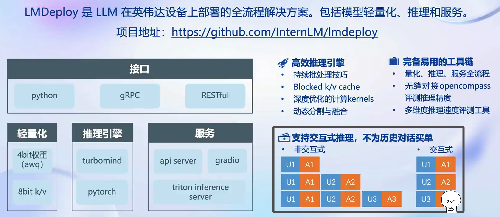

**大模型部署具有独特的背景，按照模型部署的朴实定义，是将训练好的模型在特定软硬件环境中启动的过程，使得模型能够接收输入并返回预测结果。为了满足性能和效率的要求，常常需要对模型进行优化(模型压缩和文件加速)**
+ **内存开销巨大**
+ **请求数不固定(动态Shape)**
+ **LLM模型的结构相较于视觉模型而言，比较简单**

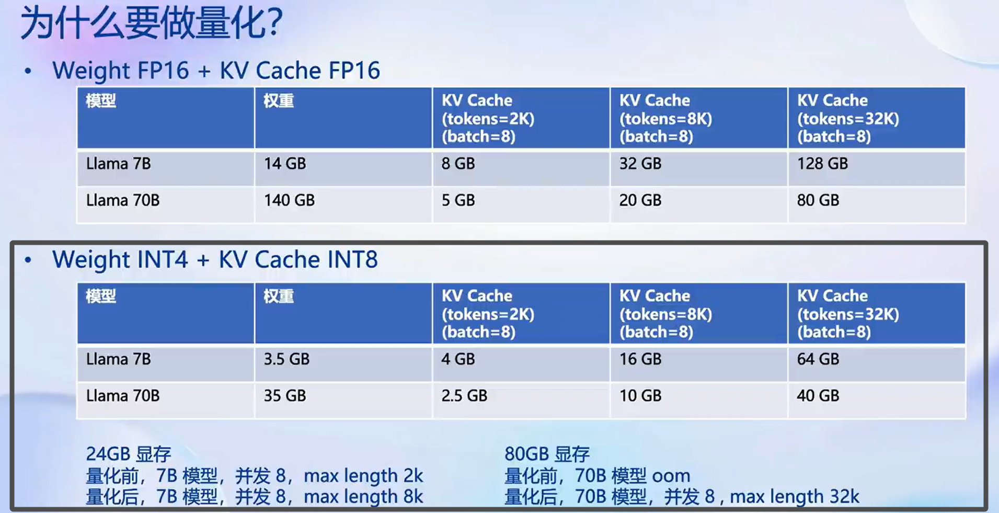

### **如何做 Weight Only 的量化？**
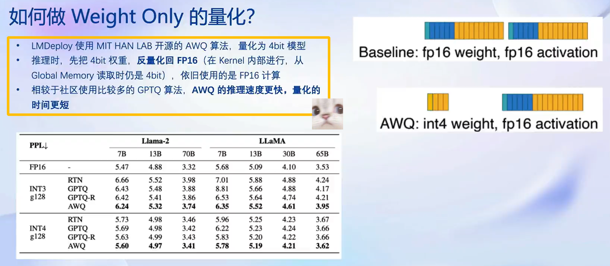

### **推理引擎**
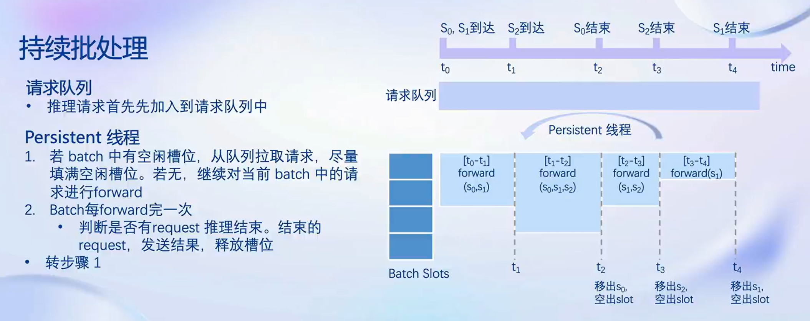

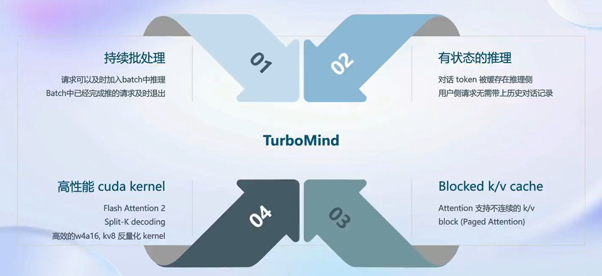

**推理引擎 TurboMind 主要包含了：**
+ **持续批处理(很有意思)**
+ **有状态的推理** 
+ **高性能 cuda kernel**
+ **Blocked k/v cache**

### **作业任务 Demo 目标**
**基础作业：**

+ **使用 LMDeploy 以本地对话、网页Gradio、API服务中的一种方式部署 InternLM-Chat-7B 模型，生成 300 字的小故事（需截图）**

**进阶作业（可选做）**

+ **将第四节课训练自我认知小助手模型使用 LMDeploy 量化部署到 OpenXLab 平台。**

+ **对internlm-chat-7b模型进行量化，并同时使用KV Cache量化，使用量化后的模型完成API服务的部署，分别对比模型量化前后和 KV Cache 量化前后的显存大小（将 bs设置为 1 和 max len 设置为512）。在自己的任务数据集上任取若干条进行Benchmark测试，测试方向包括：**
    1. **TurboMind推理 + Python代码集成**
    2. **在 1) 的基础上采用W4A16量化**
    3. **在 1) 的基础上开启KV Cache量化**
    4. **在 2) 的基础上开启KV Cache量化**
    5. **使用Huggingface推理**

#### **基础作业(课程要求项)**

##### **(1) 环境配置**
**首先我们可以使用 vgpu-smi  查看显卡资源使用情况。**

**也可以点击终端（TERMINAL）窗口右侧的「+」号创建新的终端窗口。大家可以新开一个窗口，执行下面的命令实时观察 GPU 资源的使用情况。**

    $ watch vgpu-smi

**这里 /share/conda_envs 目录下的环境是官方准备好的基础环境，因为该目录是共享只读的，而我们后面需要在此基础上安装新的软件包，所以需要复制到我们自己的 conda 环境。**

    $ conda create -n CONDA_ENV_NAME --clone /share/conda_envs/internlm-base

**如果clone操作过慢，可采用如下操作:**

    $ /root/share/install_conda_env_internlm_base.sh lmdeploy

**我们取 CONDA_ENV_NAME 为 lmdeploy，复制完成后，可以在本地查看环境。**

    $ conda env list

**结果如下所示。**

    # conda environments:
    #
    base                  *  /root/.conda
    lmdeploy                 /root/.conda/envs/lmdeploy

**然后激活环境。**

    $ conda activate lmdeploy

**安装 LMDeploy**

    # 解决 ModuleNotFoundError: No module named 'packaging' 问题
    pip install packaging

    # 使用 flash_attn 的预编译包解决安装过慢问题
    pip install /root/share/wheels/flash_attn-2.4.2+cu118torch2.0cxx11abiTRUE-cp310-cp310-linux_x86_64.whl

    pip install 'lmdeploy[all]==v0.1.0'

##### **(2) 服务部署**
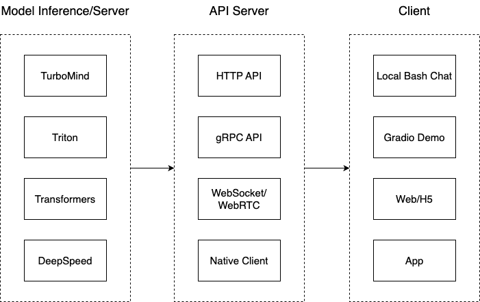

**我们把从架构上把整个服务流程分成下面几个模块。**

**模型推理/服务。主要提供模型本身的推理，一般来说可以和具体业务解耦，专注模型推理本身性能的优化。可以以模块、API等多种方式提供。**
+ **Client - 可以理解为前端，与用户交互的地方。**
+ **API Server - 一般作为前端的后端，提供与产品和服务相关的数据和功能支持。**

**lmdeploy 支持直接读取 Huggingface 模型权重**

    # 需要能访问 Huggingface 的网络环境
    lmdeploy chat turbomind internlm/internlm-chat-20b-4bit --model-name internlm-chat-20b
    lmdeploy chat turbomind Qwen/Qwen-7B-Chat --model-name qwen-7b

**我们也可以直接启动本地的 Huggingface 模型，如下所示。**

    lmdeploy chat turbomind /share/temp/model_repos/internlm-chat-7b/  --model-name internlm-chat-7b

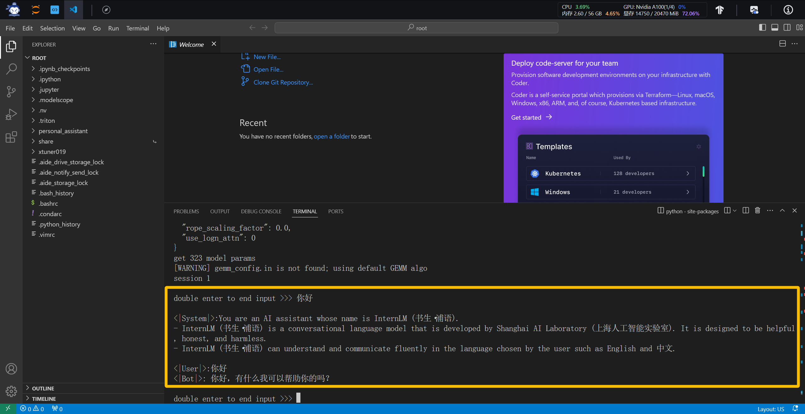

##### **(3) Demo 演示 + TurboMind 推理(基础作业)**

**支持多种方式运行，比如Turbomind、PyTorch、DeepSpeed。但 PyTorch 和 DeepSpeed 调用的其实都是 Huggingface 的 Transformers 包，PyTorch表示原生的 Transformer 包，DeepSpeed 表示使用了 DeepSpeed 作为推理框架。Pytorch/DeepSpeed 目前功能都比较弱，不具备生产能力，不推荐使用。**

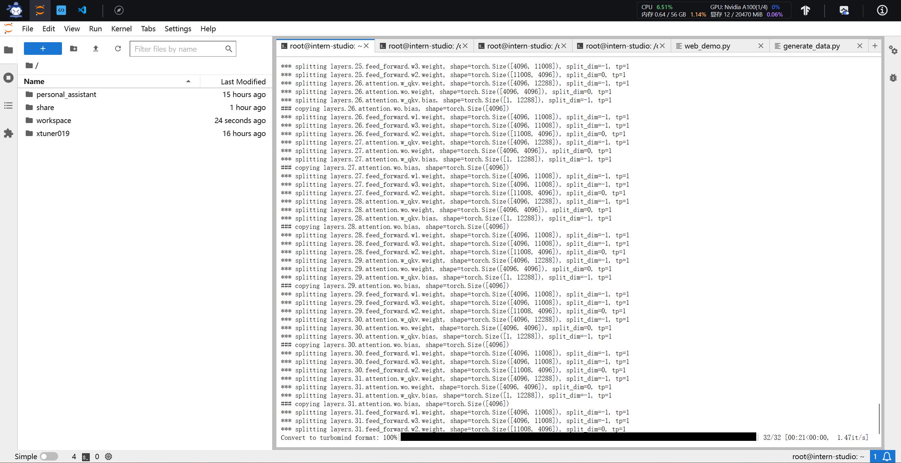

**执行命令如下：**

    # Turbomind
    lmdeploy chat turbomind ./workspace

**或启动命令服务：**

    # ApiServer+Turbomind   api_server => AsyncEngine => TurboMind
    lmdeploy serve api_server ./workspace \
        --server_name 0.0.0.0 \
        --server_port 23333 \
        --instance_num 64 \
        --tp 1

**若结合 gradio 则修改命令(不修改结构)：**

    # Gradio+ApiServer。必须先开启 Server，此时 Gradio 为 Client
    lmdeploy serve gradio http://0.0.0.0:23333 \
        --server_name 0.0.0.0 \
        --server_port 6006 \
        --restful_api True

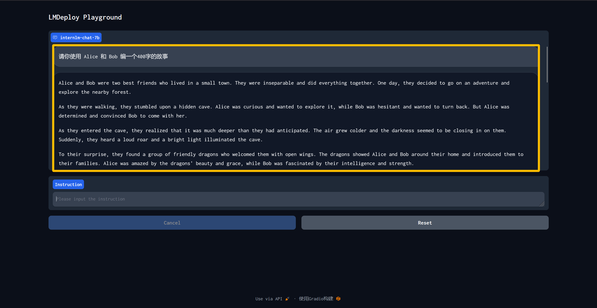

---

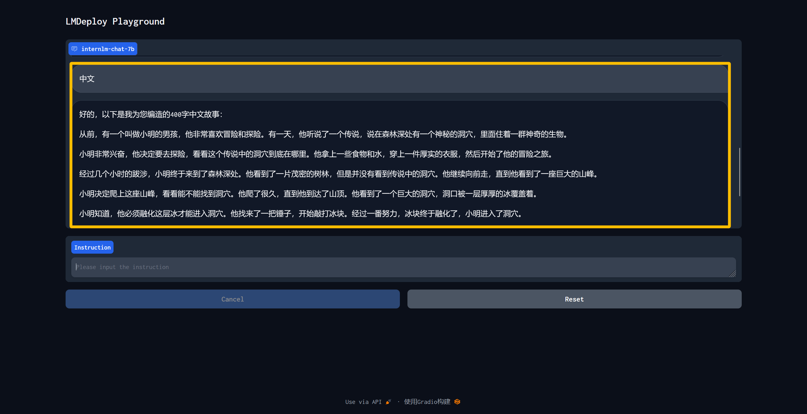

**对于其网络逻辑，我们用以下方式实现：**

    from lmdeploy import turbomind as tm

    # load model
    model_path = "/root/share/temp/model_repos/internlm-chat-7b/"
    tm_model = tm.TurboMind.from_pretrained(model_path, model_name='internlm-chat-20b')
    generator = tm_model.create_instance()

    # process query
    query = "你好啊兄嘚"
    prompt = tm_model.model.get_prompt(query)
    input_ids = tm_model.tokenizer.encode(prompt)

    # inference
    for outputs in generator.stream_infer(
            session_id=0,
            input_ids=[input_ids]):
        res, tokens = outputs[0]

    response = tm_model.tokenizer.decode(res.tolist())
    print(response)

## 补充(进阶作业相关)

### 模型量化(进阶作业 Demo)

**KV Cache 量化是将已经生成序列的 KV 变成 Int8，使用过程一共包括三步：**

**第一步：计算 minmax。主要思路是通过计算给定输入样本在每一层不同位置处计算结果的统计情况。**

**对于 Attention 的 K 和 V：取每个 Head 各自维度在所有Token的最大、最小和绝对值最大值。对每一层来说，上面三组值都是 (num_heads, head_dim) 的矩阵。这里的统计结果将用于本小节的 KV Cache。对于模型每层的输入：取对应维度的最大、最小、均值、绝对值最大和绝对值均值。每一层每个位置的输入都有对应的统计值，它们大多是 (hidden_dim, ) 的一维向量，当然在 FFN 层由于结构是先变宽后恢复，因此恢复的位置维度并不相同。这里的统计结果用于下个小节的模型参数量化，主要用在缩放环节。**

**第一步执行命令如下：**

    # 计算 minmax
    lmdeploy lite calibrate \
    --model  /root/share/temp/model_repos/internlm-chat-7b/ \
    --calib_dataset "c4" \
    --calib_samples 128 \
    --calib_seqlen 2048 \
    --work_dir ./quant_output

**在这个命令行中，会选择 128 条输入样本，每条样本长度为 2048，数据集选择 C4，输入模型后就会得到上面的各种统计值。值得说明的是，如果显存不足，可以适当调小 samples 的数量或 sample 的长度。**

**这一步由于默认需要从 Huggingface 下载数据集，国内经常不成功。所以我们导出了需要的数据，大家需要对读取数据集的代码文件做一下替换。共包括两步：**

1. **复制 calib_dataloader.py 到安装目录替换该文件：cp /root/share/temp/datasets/c4/calib_dataloader.py  /root/.conda/envs/lmdeploy/lib/python3.10/site-packages/lmdeploy/lite/utils/**
2. **将用到的数据集（c4）复制到下面的目录：cp -r /root/share/temp/datasets/c4/ /root/.cache/huggingface/datasets/**

**第二步：通过 minmax 获取量化参数。主要就是利用下面这个公式，获取每一层的 K V 中心值(zp)和缩放值(scale)。**

    zp = (min+max) / 2
    scale = (max-min) / 255
    quant: q = round( (f-zp) / scale)
    dequant: f = q * scale + zp

**有这两个值就可以进行量化和解量化操作了。具体来说，就是对历史的 K 和 V 存储 quant 后的值，使用时在 dequant。**

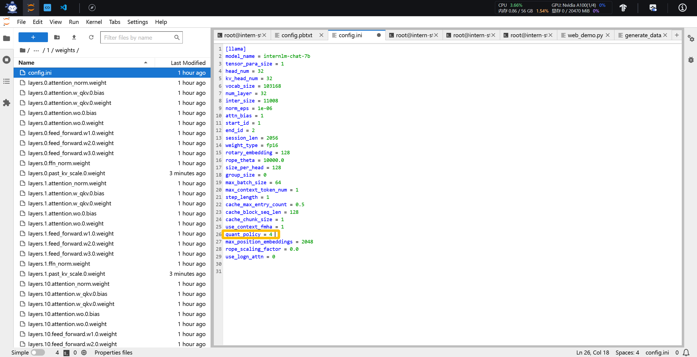

**第二步的执行命令如下：**

    # 通过 minmax 获取量化参数
    lmdeploy lite kv_qparams \
    --work_dir ./quant_output  \
    --turbomind_dir workspace/triton_models/weights/ \
    --kv_sym False \
    --num_tp 1

**在这个命令中，num_tp 的含义前面介绍过，表示 Tensor 的并行数。每一层的中心值和缩放值会存储到 workspace 的参数目录中以便后续使用。kv_sym 为 True 时会使用另一种（对称）量化方法，它用到了第一步存储的绝对值最大值，而不是最大值和最小值。**

**第三步：修改配置。也就是修改 weights/config.ini 文件的 KV int8 开关，只需要把 quant_policy 改为 4 即可。**

**运行效果如下所示**

---

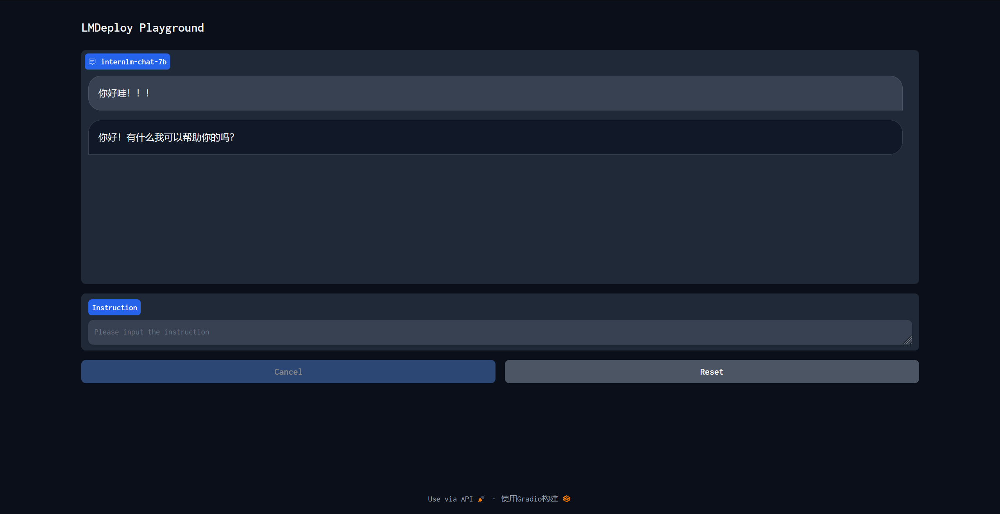

---

**W4A16中的A是指Activation，保持FP16，只对参数进行 4bit 量化。使用过程也可以看作是三步。**

**第一步：同 1.3.1，不再赘述。**

**第二步：量化权重模型。利用第一步得到的统计值对参数进行量化，执行命令如下：**

    # 量化权重模型
    lmdeploy lite auto_awq \
    --model  /root/share/temp/model_repos/internlm-chat-7b/ \
    --w_bits 4 \
    --w_group_size 128 \
    --work_dir ./quant_output 

**命令中 w_bits 表示量化的位数，w_group_size 表示量化分组统计的尺寸，work_dir 是量化后模型输出的位置。这里需要特别说明的是，因为没有 torch.int4，所以实际存储时，8个 4bit 权重会被打包到一个 int32 值中。所以，如果你把这部分量化后的参数加载进来就会发现它们是 int32 类型的。**

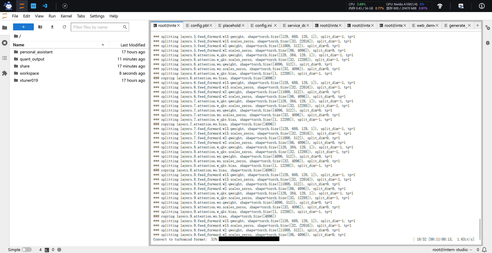

**最后一步：转换成 TurboMind 格式。**

    # 转换模型的layout，存放在默认路径 ./workspace 下
    lmdeploy convert  internlm-chat-7b ./quant_output \
        --model-format awq \
        --group-size 128

**这个 group-size 就是上一步的那个 w_group_size。如果不想和之前的 workspace 重复，可以指定输出目录：--dst_path，比如：**

    lmdeploy convert  internlm-chat-7b ./quant_output \
        --model-format awq \
        --group-size 128 \
        --dst_path ./workspace_quant

**运行效果如下所示，可以发现显存占用大幅度降低。****

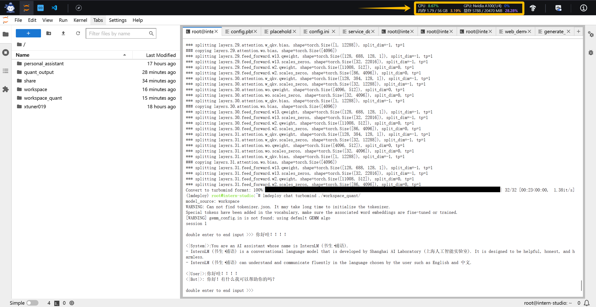

**考虑到模型大作业有很多技术分数，其他进阶作业(上传与测试)会在后续大作业部署之中完成。**

## 链接
**视频：LMDeploy 大模型量化部署实践**

https://www.bilibili.com/video/BV1iW4y1A77P/?spm_id_from=333.788&vd_source=cb911a92ddd7e0d930b1daa60c3fc181
