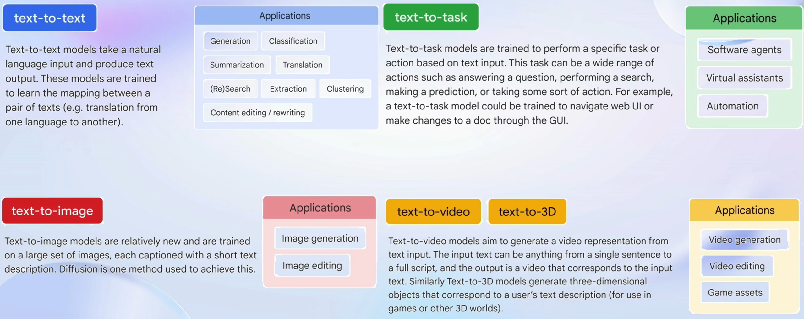
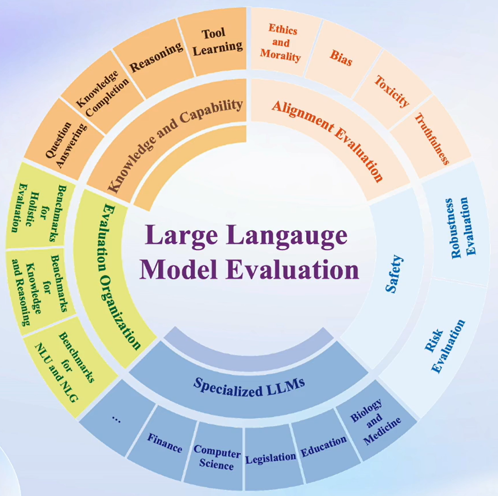
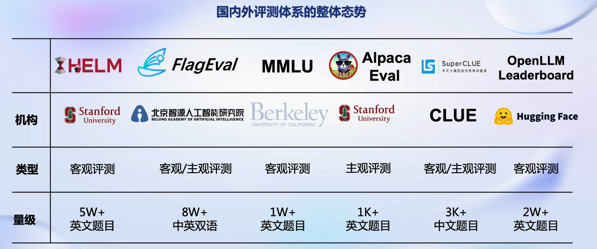
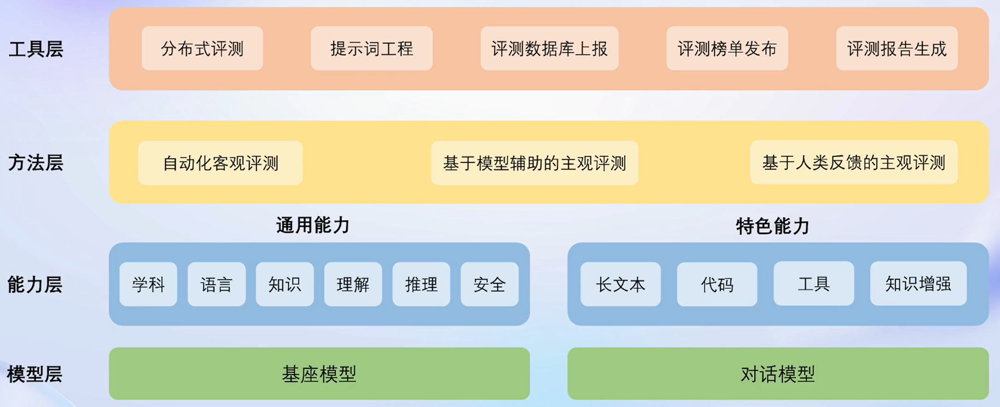
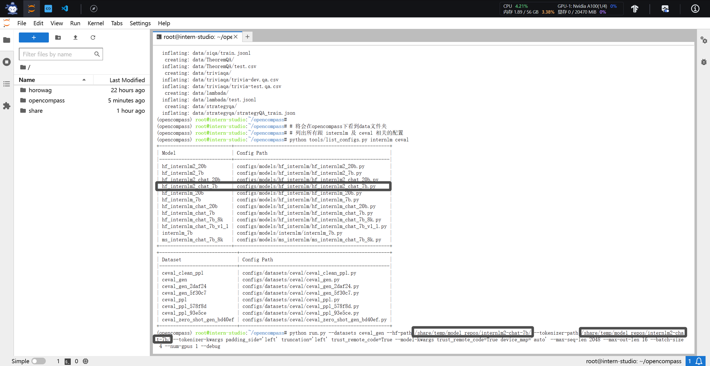
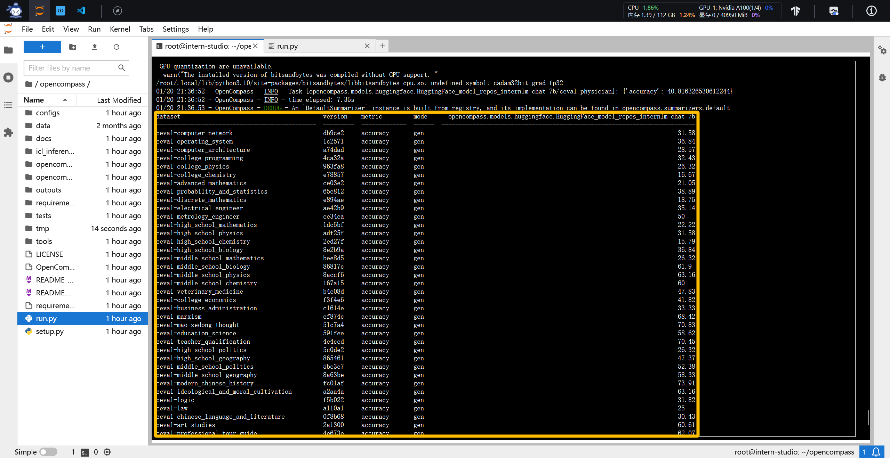
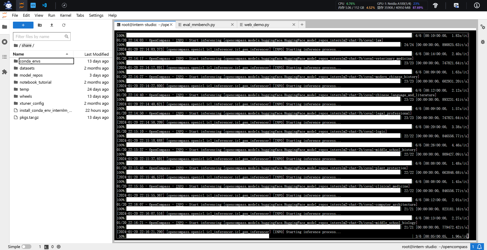
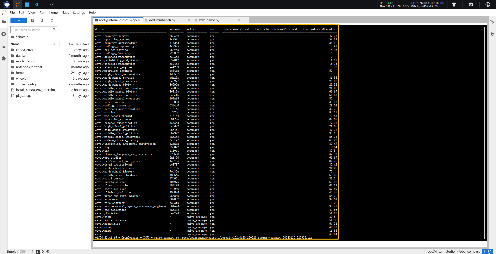
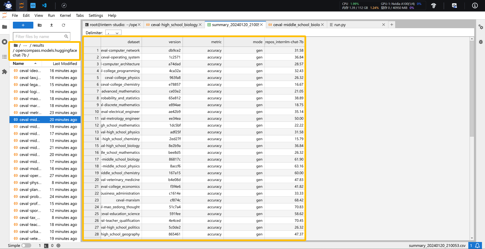

# 🙌**书生·浦语(InternLM)-openLesson-6**🙌
> **“这是实战营的最后一课了。好耶！” -> 我**
## **OpenCompass 大模型评测**

---
### **Introduction**
**我们需要认真考虑三个问题：**
+ **为什么需要评测？**
+ **我们需要测什么？**
+ **怎么样测试大语言模型？**

#### ① **为什么需要评测？**

**评测包括了“模型选型”、“模型能力提升”以及“真实应用场景的效果评测”。对于不同的模型，我们需要使用恒定统一的标准进行测量。这样可以让用户客观了解模型的优劣；让开发者掌握模型的边界属性；让管理机构减少大模型带来的社会风险；让产业界了解与目标模型相契合的应用交叉方法。**

#### ② **我们需要测什么？**

**测试的主要内容包括了“知识、推理和语言”；“长文本、智能体以及多轮对话”；“情感、认知以及价值观。我们可以尝试根据不同的场景需求，定向完成模型评估过程。”**

#### ③ **怎么样测试大语言模型？**

**评测方式包括了“自动化客观评测”、“人机交互评测”、“基于大模型的大模型评测”。实际上，如果遇到较为复杂的评测条件，利用较高能力的大模型去完成较小模型的评测工作是很常见的。**

### **主流大模型的评测框架**

### **OpenCompass评测平台**

**OpenCompass 是由 Meta 官方推荐(截止至2024年)，唯一由国内开发的大模型评测体系。(区别于 Huggingface、Stanford 和 Google) 该体系其主要从工具层、方法层、能力层以及模型层实现了完整的评测系统。**

**具体解释如下：**

- **模型层：大模型评测所涉及的主要模型种类，OpenCompass以基座模型和对话模型作为重点评测对象。**
- **能力层：OpenCompass从本方案从通用能力和特色能力两个方面来进行评测维度设计。在模型通用能力方面，从语言、知识、理解、推理、安全等多个能力维度进行评测。在特色能力方面，从长文本、代码、工具、知识增强等维度进行评测。**
- **方法层：OpenCompass采用客观评测与主观评测两种评测方式。客观评测能便捷地评估模型在具有确定答案（如选择，填空，封闭式问答等）的任务上的能力，主观评测能评估用户对模型回复的真实满意度，OpenCompass采用基于模型辅助的主观评测和基于人类反馈的主观评测两种方式。**
- **工具层：OpenCompass提供丰富的功能支持自动化地开展大语言模型的高效评测。包括分布式评测技术，提示词工程，对接评测数据库，评测榜单发布，评测报告生成等诸多功能。**

### **作业(任务目标)**

基础作业：
+ **使用 OpenCompass 评测 InternLM2-Chat-7B 模型在 C-Eval 数据集上的性能**

进阶作业：
+ **使用 OpenCompass 评测 InternLM2-Chat-7B 模型使用 LMDeploy 0.2.0 部署后在 C-Eval 数据集上的性能**

### **快速开始**
---
#### **(1) 面向GPU的环境安装**

    conda create --name opencompass --clone=/root/share/conda_envs/internlm-base
    source activate opencompass
    git clone https://github.com/open-compass/opencompass
    cd opencompass
    pip install -e .

#### **(2) 数据准备**

    # 解压评测数据集到 data/ 处
    cp /share/temp/datasets/OpenCompassData-core-20231110.zip /root/opencompass/
    unzip OpenCompassData-core-20231110.zip

    # 将会在opencompass下看到data文件夹

**查看支持的数据集和模型**

    # 列出所有跟 internlm 及 ceval 相关的配置
    python tools/list_configs.py internlm ceval

#### **(3) 开始评测**

**确保按照上述步骤正确安装 OpenCompass 并准备好数据集后，可以通过以下命令评测 InternLM-Chat-7B 模型在 C-Eval 数据集上的性能。由于 OpenCompass 默认并行启动评估过程，我们可以在第一次运行时以 --debug 模式启动评估，并检查是否存在问题。在 --debug 模式下，任务将按顺序执行，并实时打印输出。**

**(基础作业)成功使用 opencompass 完成评测。**

## **补充(作业相关)**

**示例测试配置在 configs/eval_demo.py 中。此配置通过 继承机制 引入所需的数据集和模型配置，并以所需格式组合 datasets 和 models 字段。**

    from mmengine.config import read_base

    with read_base():
        from .datasets.siqa.siqa_gen import siqa_datasets
        from .datasets.winograd.winograd_ppl import winograd_datasets
        from .models.opt.hf_opt_125m import opt125m
        from .models.opt.hf_opt_350m import opt350m

    datasets = [*siqa_datasets, *winograd_datasets]
    models = [opt125m, opt350m]

**(目标) 评测 internlm2-chat-7b**

**OpenCompass 提供了一系列预定义的模型配置，位于 configs/models 下。以下是与 opt-350m（configs/models/opt/hf_opt_350m.py）相关的配置片段：**

    # 使用 `HuggingFaceCausalLM` 评估由 HuggingFace 的 `AutoModelForCausalLM` 支持的模型
    from opencompass.models import HuggingFaceCausalLM

    # OPT-350M
    opt350m = dict(
        type=HuggingFaceCausalLM,
        # `HuggingFaceCausalLM` 的初始化参数
        path='facebook/opt-350m',
        tokenizer_path='facebook/opt-350m',
        tokenizer_kwargs=dict(
            padding_side='left',
            truncation_side='left',
            proxies=None,
            trust_remote_code=True),
        model_kwargs=dict(device_map='auto'),
        # 下面是所有模型的共同参数，不特定于 HuggingFaceCausalLM
        abbr='opt350m',               # 结果显示的模型缩写
        max_seq_len=2048,             # 整个序列的最大长度
        max_out_len=100,              # 生成的最大 token 数
        batch_size=64,                # 批量大小
        run_cfg=dict(num_gpus=1),     # 该模型所需的 GPU 数量
        )

**🍏上图是作业相关的结果路径和数值表格🍎**

---

**考虑到模型大作业有很多技术分数，其他进阶作业会在后续大作业部署之中完成。**

## 链接
**视频：OpenCompass 大模型评测**

https://www.bilibili.com/video/BV1Gg4y1U7uc/?spm_id_from=333.999.0.0&vd_source=cb911a92ddd7e0d930b1daa60c3fc181

**🍏完结撒花~~🍎**