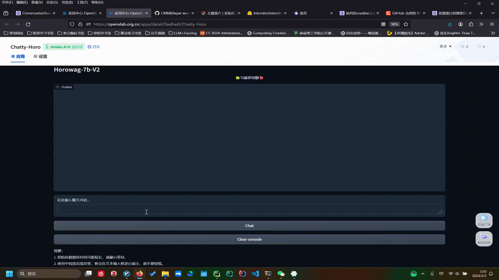

# InternLM_openNotebook && 🍏Chatty_Horo🍎
 

## 😊书生·浦语 (InternLM) 开源大语言模型课程笔记😊

+ 🍟Lesson - 1🍟
notebookLink: [Lesson-1 链接](https://github.com/SaaRaaS-1300/InternLM_openNotebook/blob/main/Lesson-1/Lesson-1-Notebook.md)

+ 🍔Lesson - 2🍔
notebookLink: [Lesson-2 链接](https://github.com/SaaRaaS-1300/InternLM_openNotebook/blob/main/Lesson-2/Lesson-2-Notebook.md)

+ 😝Lesson - 3😝
notebookLink: [Lesson-3 链接](https://github.com/SaaRaaS-1300/InternLM_openNotebook/blob/main/Lesson-3/Lesson-3-Notebook.md)

+ 🤠Lesson - 4🤠
notebookLink: [Lesson-4 链接](https://github.com/SaaRaaS-1300/InternLM_openNotebook/blob/main/Lesson-4/Lesson-4-Notebook.md)

+ 😶‍🌫️Lesson - 5😶‍🌫️
notebookLink: [Lesson-5 链接](https://github.com/SaaRaaS-1300/InternLM_openNotebook/blob/main/Lesson-5/Lesson-5-Notebook.md)

+ 👻Lesson - 6👻
notebookLink: [Lesson-6 链接](https://github.com/SaaRaaS-1300/InternLM_openNotebook/blob/main/Lesson-6/Lesson-6-Notebook.md)

## 🌠版本更新🌠

---

| 版本号 | 模型相关解释 |
|:-------:|:-------:|
| **Horowag_7b** | **InternLM2-Chat-7b 微调后的基础赫萝对话模型** |
| **Horowag_7b_Craft** | **优化数据增强方法 + Langchain 辅助模型输出** |
| **Horowag_Mini** | **InternLM2-Chat-1_8b 微调后的轻量级赫萝对话模型** |
| **Chatty_Horo_Voich** | **InternLM2-Chat-7b 微调 + Assistant Model + VITS** |
| **-- 暂未完成 --** | **--** |

**How to Install ? 👇**

    pip install -r requirements.txt

**选择你想要使用的模型，点开文件之后 ->**

    python start.py

**Resource About Models 👇** 
+ **InternLM2-Chat-7b + 微调 = [Horowag_7b_Chat_Ani](https://openxlab.org.cn/models/detail/SaaRaaS/Horowag_7b)**
+ **InternLM2-Chat-1_8b + 微调 = [Horowag_1_8b_Chat_Mini](https://openxlab.org.cn/models/detail/SaaRaaS/Horowag_Mini)**

## 🍏OpenXLab🍎

**下载模型的代码示例：**

    from openxlab.model import download
    # 加载基础的语言模型 Horowag_7b
    download(model_repo='SaaRaaS/Horowag_7b',
             output='Horowag_7b')

**目前模型应用的部署情况：**

+ **应用程序链接** <<< 🍏[Chatty-Horo](https://openxlab.org.cn/apps/detail/SaaRaaS/Chatty-Horo)🍎 >>>
+ **OpenXLab模型链接：**[OpenXLab-Horo](https://openxlab.org.cn/models/detail/SaaRaaS/Horowag_7b)

---

 
 
  
 

## 🤖贡献墙🤖

+ **🆕那路 -> Horowag_7b🆕**

+ **🆕那路 -> Horowag_Mini🆕**

+ **🆕那路 -> Horowag_7b_Chat_Ani🆕**

+ **🆕那路 -> WebUI🆕**

+ **✨[Claire 同学](https://space.bilibili.com/14888344?spm_id_from=333.1007.0.0) -> 提供美术支持✨**

+ **✨[Claire 同学](https://space.bilibili.com/14888344?spm_id_from=333.1007.0.0) + 那路 -> 制备微调数据集✨**

## 👻致谢👻

+ **☃️感谢 [书生·浦语开源训练营](https://github.com/InternLM) 的技术指导以及算力☃️**

+ **✨感谢 白洁 参与 `1.8b` 模型的相关工作✨**

## 🍔[B站技术分享](https://www.bilibili.com/video/BV1V7421N7ae/?share_source=copy_web&vd_source=1019285f8b0281a44f38cf7445f38144)🍔

 
 
  
 

