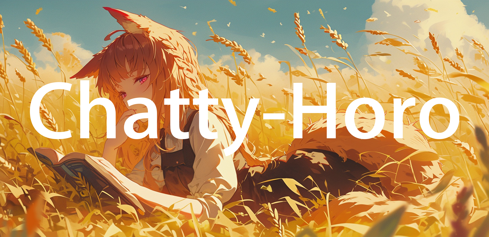

# InternLM_openNotebook

## 😊书生·浦语 (InternLM) 开源大语言模型课程笔记😊

+ 🍟Lesson - 1🍟
notebookLink: [Lesson-1 链接](https://github.com/SaaRaaS-1300/InternLM_openNotebook/blob/main/Lesson-1/Lesson-1-Notebook.md)

+ 🍔Lesson - 2🍔
notebookLink: [Lesson-2 链接](https://github.com/SaaRaaS-1300/InternLM_openNotebook/blob/main/Lesson-2/Lesson-2-Notebook.md)

+ 😝Lesson - 3😝
notebookLink: [Lesson-3 链接](https://github.com/SaaRaaS-1300/InternLM_openNotebook/blob/main/Lesson-3/Lesson-3-Notebook.md)

+ 🤠Lesson - 4🤠
notebookLink: [Lesson-4 链接](https://github.com/SaaRaaS-1300/InternLM_openNotebook/blob/main/Lesson-4/Lesson-4-Notebook.md)

+ 😶‍🌫️Lesson - 5😶‍🌫️
notebookLink: [Lesson-5 链接](https://github.com/SaaRaaS-1300/InternLM_openNotebook/blob/main/Lesson-5/Lesson-5-Notebook.md)

+ 👻Lesson - 6👻
notebookLink: [Lesson-6 链接](https://github.com/SaaRaaS-1300/InternLM_openNotebook/blob/main/Lesson-6/Lesson-6-Notebook.md)

## 🌠版本更新🌠

| 版本号 | 模型相关解释 |
|:-------:|:-------:|
| **Horowag_7b_V1** | **InternLM2-Chat-7b 微调后的基础赫萝对话模型** |
| **Horowag_7b_V2** | **优化数据增强方法 + Langchain 辅助模型输出** |
| **-- 暂未完成 --** | **--** |

## 🍏OpenXLab🍎

**下载模型的代码示例：**

    from openxlab.model import download
    # 加载基础的语言模型 Horowag_7b
    download(model_repo='SaaRaaS/Horowag_7b',
            model_name=['pytorch_model-00001-of-00008',
                        'pytorch_model-00002-of-00008',
                        'pytorch_model-00003-of-00008',
                        'pytorch_model-00004-of-00008',
                        'pytorch_model-00005-of-00008',
                        'pytorch_model-00006-of-00008',
                        'pytorch_model-00007-of-00008',
                        'pytorch_model-00008-of-00008',
                        'config.json',
                        'configuration_internlm.py',
                        'generation_config.json',
                        'modeling_internlm2.py',
                        'pytorch_model.bin.index.json',
                        'special_tokens_map.json',
                        'tokenization_internlm.py',
                        'tokenizer.model',
                        'tokenizer_config.json'],
            output='Horowag_7b')

**目前模型应用的部署情况：**

+ **应用程序链接** <<< 🍏[Chatty-Horo](https://openxlab.org.cn/apps/detail/SaaRaaS/Chatty-Horo)🍎 >>>

<video src="horowag_demo.mp4"></video>

## 👻致谢👻

+ **☃️感谢 [书生·浦语开源训练营](https://github.com/InternLM) 的技术指导以及算力☃️**

+ **✨感谢 [Claire 同学](https://space.bilibili.com/14888344?spm_id_from=333.1007.0.0) 提供的美术支持✨**

## 🍔[B站技术分享]()🍔

 
 
  
 

